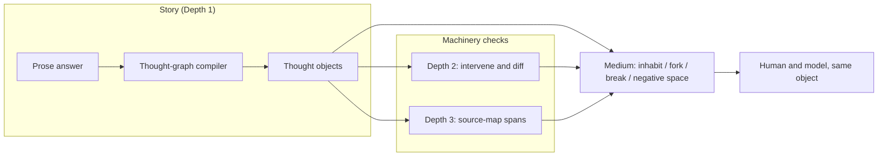
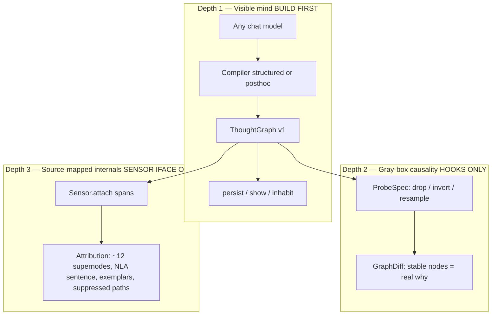
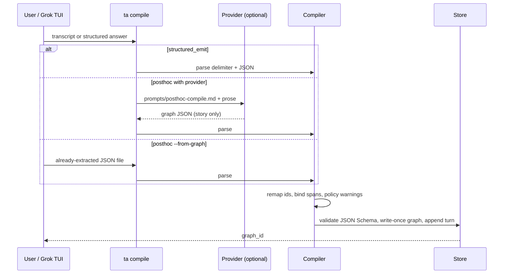
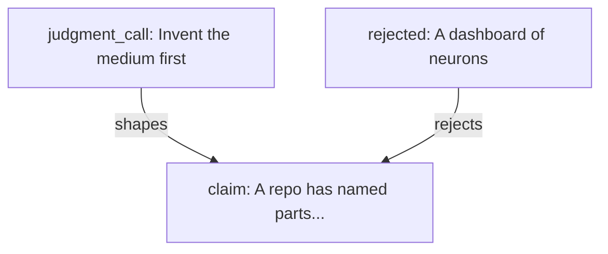

# Thought Archaeology Framework — Inspectable AI Mind as a Collaborative Medium

| Field | Value |
|---|---|
| **Title** | Thought Archaeology Framework — Inspectable AI Mind as a Collaborative Medium |
| **Author** | Grok (design-doc-writer) |
| **Date** | 2026-08-27 |
| **Status** | Draft |
| **Code lives at** | The repository root. Runtime data uses the documented store-resolution order. |
| **Audience** | Senior engineer implementing Depth 1 in this repo; later Depth 2/3 hooks |
| **Schema version specified here** | `1.0.0` |

---

## Navigation clarity amendment — 2026-09-05 (Codex / Astra)

This amendment supersedes older descriptions below of Up as an unconditional
north shortcut, click-to-traverse, and the generation-only Atlas Map.

The chamber remains a local, recentered 3D view. A persistent wayfinder identifies
the Threadwalk, answer attribution, and exact thought's stable ordinal; this
ordinal is not a prescribed reading order or the number of steps walked.
The standing thought stays visible while a separate destination card previews
the next move. Left/right or a spatial click selects; Enter/Up or the explicit
destination button enters that selection. Without a selection, both keys use
the first forward thought. At an endpoint they do not choose a side road for you.
Layer-specific Field Note and Knowledge Capsule controls remain distinct.

Retrace (B/Down) follows actual visits. Answer start (O) goes to this graph's
entry thought. A separately named source return goes to the exact question
that produced a collaborator's answer. Returning to an earlier trail destination
trims the retrace stack instead of creating an origin/back loop. Recent trail
buttons, visited destination text, and visited map rings support recognition.
This is bounded tab-local navigation memory (80 trail entries, 200 visited
thoughts, eight visible recent destinations), not a canonical research artifact.
Refresh recovers the trail when resuming the same exact stand; storage failure
does not prevent navigation. Loading is guarded against duplicate traversal;
a failed request leaves the previous stand and trail intact with a visible error.

A opens the thoughts of the current answer, including premises, rejected roads,
and uncertainties. All answers switches to the whole-Threadwalk generation
map; selecting an answer and choosing Thoughts in this answer previews its
internal map without moving the inhabitant. Every destination has a numbered
relic and full-text keyboard/touch list. Selection and visiting are separate.
Current and visited markers use graph plus node identity; recorded relationship
lines are not inferred causal evidence. Large maps retain pan/zoom, and the
scene gets its own viewport so it does not disappear behind the map controls.
T remains the answer-level compass; choosing the current answer preserves the
exact current thought instead of resetting to its entry node.

Python provides `position` in the standing payload and `chamber_map` in the
thread payload, scoped to the requested graph in that session. No graph-store
format, provider action, hidden reasoning, or publication behavior changes.
This source change is not automatically a deployed-site or installer update.

## Living terminology amendment — 2026-08-28

The user adopted **judgment call** as the canonical term because it states the concept directly: a consequential choice not forced by the premises. New graphs use `judgment_call`; the shaping edge is `shapes`; fingerprints expose `model_judgments`. Readers and loaders still accept the original `taste_call`, `taste_of`, and `model_taste` spellings so append-only artifacts remain readable.

The first functional Depth-2 slice now implements `drop_premise` through the existing shell provider and fork-regeneration path. A successful run stores an append-only child graph and `GraphDiff`; `invert_constraint`, `resample`, and `steer_later` remain explicit stubs. The detailed PR5 sections below describe the original v1 boundary and remain as design history.

## Living future-layers amendment — 2026-08-28

The long-term goal is layered causal archaeology. The current thought-graph remains the human coordinate system; deeper evidence attaches to the same nodes rather than replacing them with a neuron viewer.

The evidence ladder is:

1. `story_report` — a human-readable thought-object inferred or emitted from the answer.
2. `context_provenance` — an input artifact, earlier turn, retrieved source, tool result, or instruction that preceded the answer.
3. `behavioral_intervention` — a controlled prompt/story change plus observed regeneration or resampling result.
4. `activation_correlation` — an internal representation associated with a thought-object, without a causal claim.
5. `neural_intervention` — an activation, feature, head, or path changed in the original model with an observed output effect.
6. `recurring_circuit` — a mechanism replicated across prompts or sessions.
7. `checkpoint_emergence` — an observed behavioral trajectory across exact checkpoints; not evidence that a particular record caused it.
8. `training_influence` — bounded gradient or data-influence evidence; never a claim of complete thought genealogy.

These are evidence kinds, not a score or a promise of equal accessibility. Closed models may stop at context and behavioral intervention. Neural and training evidence requires an instrumented model or vendor interface.

Every cross-layer claim is stored as an append-only `EvidenceBinding` attached to one thought-node. A binding records its `kind`, whether it `supports`, `contradicts`, or is `inconclusive`, the concrete artifact references on which it rests, and an optional parent binding when evidence forms a multi-generational chain. Bindings never mutate `ThoughtGraph`, never assert that prose and machinery are identical, and never encode a synthetic numeric confidence.

The first read surface is node-centered: `ta inhabit` lists the typed chain beneath the standing thought, and the Inhabit Space speaks one concise server-authored evidence sentence. Pressing `e` opens an archaeological record whose **why this path** section reads only story relations already present in the graph—supporting premises, shaping judgments, analogies, qualifications, descendants, and rejected roads. Separate server-authored strata then show evidence lineage and concrete artifacts. The browser never invents a rationale or derives evidence strength. An empty binding set is displayed as absence, not as evidence against the thought.

Inhabit Space may accompany an ongoing conversation at the boundary of finalized turns. It polls the local store; a new graph head written by `ta compile` rises as an optional doorway beside the currently inhabited chamber and never teleports the user. Completion refreshes the current server-authored stand in place, so the new doorway appears without a manual browser reload; insertion is incremental, preserving every existing mesh and rise state so only the new doorway spawns. Arrival is deferred while the inhabitant is composing or inspecting a pane. A selected path preview does not defer completion indefinitely: completion clears the preview and raises the doorway. A continuation doorway exposes its recorded harness and graph model so changing harnesses never makes authorship depend on visual guesswork. After entry, that graph-level attribution remains visible at every chamber while each object retains its semantic kind. Reloading an older stand recovers a newer same-session head as a doorway instead of silently initializing it as already known. A companion door remains anchored to the graph where it arrived; unrelated historical doors do not follow the inhabitant into a new graph. A continuation completion supplies one canonical return to the exact source chamber. That return alone uses a distinct red ring, red selection light, distinct relic, and the description “Return to conversation origin.” Entering marks the arrival seen and may preserve a quieter reciprocal doorway between those two stands in bounded browser memory. Poll enrichment identifies a doorway by graph and node together, preventing a reciprocal stand elsewhere in the same graph from causing repeated relayouts. The graph store remains canonical. This is not token streaming, hidden chain-of-thought access, or a claim to expose the forward pass.

### Living traversal and harness amendment — 2026-08-29

Traversal must distinguish three relations spatially and semantically. Direct story continuations are server-authored and appear ahead one edge at a time; the transitive omit-set remains available for fork impact but is not a navigation shortcut. Rejected alternatives and vetoes remain roads to the left. Cross-graph companion and reciprocal conversation doors appear to the right only at graph origins and terminal chambers, rather than following the inhabitant through every intermediate chamber. Re-centering therefore never silently turns a conversational return into an apparent story edge.

Connecting a different AI harness never deletes the existing archaeology. The response is a new append-only graph head whose doorway names the completion harness and graph model. If the page reloads after completion while the inhabitant remains in an older graph, the newer same-session head must reappear as a recoverable doorway. A clean exploration is a new session, not destructive history clearing.

Conversation-door memory is local to the graph where each door arrived. Entering a continuation leaves unrelated older doors behind and carries only an explicit route back to the request's source chamber. The source remains relevant because the new graph continued it; the rest of global history does not become part of that continuation merely by existing.

Graph-local doorways are not sufficient orientation once many append-only generations accumulate. Pressing `t` opens a centered **Thread Compass** over the still-visible, blurred chamber. Its contents are server-authored from the current session's durable graph parentage and continuation receipts: one entry per graph generation, not one per thought-node. It marks the inhabited graph and mutable session head separately, identifies AI continuations by recorded harness/model, distinguishes human cuts and vetoes, pins the most recent AI response, and re-enters any generation through its canonical entry chamber. This is a navigation projection only; it writes no graph data and does not replace spatial doors.

Pressing `a` separately toggles the **Atlas Map**: a stable top-down grid of every graph generation in the current Threadwalk, derived from the same `/api/thread/{session}` read model. It reuses each generation's canonical entry thought and relic form, draws durable parent connections, and marks the inhabited generation with a luminous `you are here` ring. Existing generations keep their chronological grid positions as later append-only generations arrive. A readable map initially fits as a whole; a larger map centers on the inhabitant at a useful scale and supports drag-to-pan plus wheel zoom. Clicking a relic exits the map and enters that generation's canonical chamber. Closing the map restores the exact prior chamber, focus, and camera state. Atlas Map writes no graph data, creates no map schema, and does not replace Thread Compass.

When at least two completed continuations share the exact stored session, source graph, source node, and trimmed prompt, Thread Compass presents them as one **Parallel continuations** group while retaining every individual generation inside it. Its read-only comparison aligns exact harness/model attribution, the server-selected entry thought, every recorded judgment and uncertainty, rejected-road counts, and both compile-time and current structural warnings. It never ranks paths, averages confidence, infers consensus, or creates a summary graph. `Esc` retraces comparison to lineage before returning to the chamber. The same Python read model is available through `ta continuation compare` and `/api/parallel/REQUEST_ID`; JavaScript only renders it.

After one completed collaborator path, **Human Field Notes** preserve what mattered to the inhabitant without requiring Parallel Continuations or a second provider subscription. At its terminal chamber a server-authored floating prompt offers `W`; the inhabitant selects one to twelve exact thought-objects, chooses conclusion, unresolved question, or observation, and creates the path's one human-authored note. Parallel Continuations remains an optional richer route whose note spans at least two paths. Creation removes eligibility. Editing appends an immutable revision to the same stable note identity and monument, leaving every earlier text and source selection inspectable; it never repeats the one-time construction ceremony. Each reference records session/graph/node identity plus SHA-256 of the exact stored graph JSON bytes; Python computes and verifies it, and source graphs do not change. Notes live at store scope, contain no copied source metadata or absolute paths, invoke no provider, and never become graph nodes, evidence, votes, rankings, or synthetic summaries. Submission materializes a hologram into a permanent Field Notes Monument in the left human-inscription alcove of every referenced chamber. Monument entry places the current note on the main reading plate, while `E` shows that revision's exact selected sources and explicitly keeps human interpretation separate from causal evidence. The authoritative bounded schema, lifecycle sounds, acceptance gate, and deferrals are in `docs/FIELD_NOTES.md`.

An eligible, human-interpreted completed path may be carried forward as one **Knowledge Capsule**. The earned notice offers `K · Construct here` or `J · Store launcher`. Storing appends one private immutable launcher without freezing anything; only one may be held, it persists across reloads, suppresses new earning, and can later deploy with `K` at any chosen chamber in its earning Threadwalk but never another Threadwalk. It is consumed only after successful manifest construction. Construction writes a mode-`0600`, write-once manifest that pins both earning and deployment chambers and freezes the complete owning-session artifact inventory through its observed head, the stable Field Note's exact current revision, session title, server disclosure wording, and exact per-artifact SHA-256 values. The 18-second hologram construction suppresses competing floating invitations and yields one charged launcher. The ready chamber exposes only **Press Enter to Launch Capsule**. Launch is local and one-shot: source integrity is rechecked, deterministic private Markdown is written before a receipt, and only a successful receipt permits the charged Capsule's flight and permanent spent-launcher state. Failed output or receipt writes remain retryable. Reload restores durable stored, ready, or launched state without replaying ceremony. The authoritative boundary is `docs/KNOWLEDGE_CAPSULES.md`.

The chamber's edge UI keeps three restrained top-line instruments: `press L for Legend and controls`, **Thread Compass · T**, and **Atlas Map · A**. Pressing `l` opens a side drawer containing the contextual cut/human-no editor, sound controls, the complete key list, and the visual legend for blue/red/bronze/violet rings, green/blue beams, and ghosted relics. Terminal continuation actions remain in their original main-space pane so reaching an ending is immediately visible and actionable without opening the drawer. The bottom plate remains descriptive.

Pressing `m` opens the distinct left-side **Workspace** drawer for explicit state-changing operations. Its collaborator list is derived only from the user-owned harness registry. Activating one collaborator changes the default for future requests and rewrites/restarts the explicit user watcher while preserving its interval and timeout; it is refused while any continuation is pending, so an existing response cannot be interrupted or relabeled. Each row has a separate right-side **Refresh** action for the workflow “choose the model in the provider harness, then refresh TA.” Refresh performs the adapter's bounded `describe` handshake, caches only its current model/version display metadata and refresh time in the mode-`0600` registry, and neither activates that harness nor restarts the watcher. The adapter re-reads its provider model setting at actual invocation; the snapshot is never authority for stored graph authorship. Neither action changes attribution on stored graphs or reads adapter credentials. **New Graph** first opens an origin composer. Submitting it creates an independent session whose single root graph is the human's inquiry represented as an uncertain thought-object, then queues that exact inquiry through the ordinary continuation protocol and enters the root while the active harness responds. The seed prevents an invalid empty graph and records the question only once in turn history. **Historical** lists session heads with title, recency, generation count, and recorded head attribution; re-entry is read-only and `t` handles generations inside the chosen session. No operation deletes or clears earlier archaeology.

First run opens a browser onboarding surface rather than requiring harness commands. The destination is named as a private local Personal Atlas; Online collaboration remains a quiet future note and implies no account, upload, or shared Atlas. The collaborator step lists only the five packaged bridges and reports which provider CLIs are already present on the machine. On Windows, Codex, Claude Code, and Grok may expose an allowlisted official native installer or visible provider-owned sign-in action; Atlas launches the documented command, receives no credentials or callback/result from that interactive flow, and requires an explicit public CLI status re-check afterward. Provider account eligibility, subscription/API billing, and model selection remain provider-owned. One click performs the bounded protocol-`1` `describe` handshake, rolls registration back on failure, and selects the successful collaborator. The inhabitant writes an opening inquiry and selects **Start a Threadwalk**. Only that final action creates an empty local store when needed, starts the one exact store/collaborator worker through the platform backend, appends the ordinary human-origin graph and continuation request, and enters the first chamber. Linux uses the user systemd backend; Windows and macOS use a worker supervised while the local application is open. Existing installations can reopen the same setup from Workspace. No credentials, arbitrary executable paths, graph-schema changes, or online behavior are introduced.

On Windows, provider discovery covers native per-user CLI locations plus Codex, Claude Code, and Grok Build in the default or explicitly selected WSL distribution. The adapter keeps provider configuration and authentication in that detected environment and translates only its own temporary paths across the WSL boundary. A ChatGPT, Claude, or Grok desktop installation alone is not a bridge: Atlas requires the provider's supported non-interactive CLI and does not inspect desktop-app private state or automate desktop UI.

Opening the browser at the application root presents three explicit destinations: **Resume Last Chamber** from browser-local stand memory, **Open Session Head** for that inquiry's current head (or the newest available head), and **Home**, which opens Workspace over the head chamber. A differing graph/node hash remains an explicit deep link. Reloading the same remembered hash restores the chooser instead of silently treating an old URL as the desired destination. This browser-local orientation memory changes no graph data.

Cycling left or right still spotlights one grid object, and now also eases both the over-the-shoulder and overhead camera centers onto that object. Manual shoulder orbit and overhead drag continue from the selected center; clearing selection or invoking camera home returns the center to the standing chamber.

A terminal chamber is one with no direct story continuation and no existing fork continuation. Its main-space pane explicitly names the end of that graph path and offers three stable states: remain in the chamber, return to the graph's chosen origin, or mark the chamber ready for continuation. Marking ready is an immediate, visibly acknowledged append-only action; clicking it again appends a cancellation receipt and reopens the choice. “Ask from here” is a toggleable selected state: its prompt expands inline below the terminal buttons so the one pane grows upward, and toggling the action again closes it without writing. Cut and human-no composition remains a separate drawer action. Submitting a continuation prompt replaces the terminal copy with an animated “AI working…” state. The state persists while the append-only request is pending and clears when completion refreshes the chamber and presents the new path, or when the user cancels. Either continuation action also closes a continuous sparking green beam from the top of the standing object to one randomly selected visible canopy neuron. That same neuron is retained for the request. On completion, the green outbound beam becomes a blue sparking return from the retained neuron to the top of the new doorway; it remains alongside the blue arrival spotlight until that doorway is entered. Browser-local memory preserves only this visual request/neuron/phase state across refreshes; the graph store remains canonical. Cancellation removes the beam.

Cut and human no are graph edits, not model edits. The Inhabit Space cut performs provider-free bookkeeping: it creates an append-only child graph that omits the selected thought plus the bounded dependents it shaped, leaves the source graph unchanged, and exposes the child as a fork doorway; it does not ask a closed model to regenerate. Human no copies the graph, preserves the challenged thought, and adds a human-authored veto node and `vetoes` edge before entering that child. A later continuation from either child may give Grok, Codex, or another closed model the altered public graph as context and therefore change its next observable answer. That is a context/behavioral counterfactual, not weight editing, training, preference feedback to the vendor, or evidence about an internal mechanism. Provider-backed regeneration remains an explicit CLI operation rather than an implicit browser gesture.

Sound is an inhabitation layer, not evidence. The committed browser ships original, sample-free cinematic OGG/Opus assets made specifically for the chamber, with no stock effects or recognizable notification sounds. After the first user interaction permits audio, the neural atmosphere remains continuous. Distinct assets mark clockwise/counterclockwise selection, forward and backward traversal, the red conversation-origin fold, blue arrival activation and entry, camera elevation, Field Note writing, monument construction, construction completion, and monument entry. A pending continuation adds its own loop; the green request beam adds an activation sound and a continuous electrical-corona loop. Completion crossfades both pending loops out and emits the blue lightning splash while the silent visual return beam persists. Continuous assets use bounded fades, conservative gains, and one master compressor because they share low-frequency energy. Evidence descent, relic inspection, cut/veto inscription, cancellation, and the Field Note eligibility invitation retain bounded procedural one-shots where no dedicated asset exists. Mute, loading state, and volume are visible, keyboard-accessible, and browser-local. Audio state never enters the graph store and never implies measured neural activity.

Future open-weight training is an explicit pipeline, not an overloaded gesture. Reviewed vetoes may become negative preference examples; reviewed cuts may become structural counterfactual examples. Useful preference or supervised training normally also requires a human-approved replacement or accepted path. A later slice may export a versioned dataset, run an explicitly chosen local fine-tune or preference optimization, and bind base-model identity, dataset revision, training recipe, and output-checkpoint provenance back into the archaeology. Pressing cut or human no must never silently update weights, and graph evidence must remain intact whether or not an export is ever trained.

Left and right selection follow a stable true-north clock centered on the inhabited chamber, independent of camera position. Left always advances counterclockwise; Right always advances clockwise; edge wrapping completes a ring through every visible path, including story and fork paths at north, so no path object is skipped. Up remains a direct shortcut to the next north path. The atmospheric neural canopy is procedural and animated, with intermittent pulse sparks, junction bursts, and request/arrival beams, but remains environmental metaphor. Its pulsing connections do not claim that the authored story graph is a measured neural circuit or expose hidden model activity.

Continuation is provider-neutral. The core writes an immutable `ContinuationRequest` containing the standing session/graph/node ids, timestamp, source, and optional prompt. A harness polls `ta continuation pending --format json` or `GET /api/continuations`, loads the referenced graph, invokes any model by its own means, compiles the finalized response through the existing `ta compile` boundary, and appends a `ContinuationCompletion` linking the request to the response graph and harness name. Withdrawal appends a separate `ContinuationCancellation`; pending state is derived by excluding requests with either closing receipt, and a canceled request cannot later be completed. No status field mutates. Thought Archaeology does not contain credentials, a vendor SDK, or a hidden model callback.

The reference harness worker is configured outside the repository and graph store in the user's XDG config. A registration contains only a name, absolute executable argv, timestamp, and optional non-secret model/version display snapshot; TA invokes it without a shell. Protocol `1` has two operations: `describe` advertises `continue` and current model metadata, while `continue` receives the immutable request plus the session, public graph, and server-authored standing view as JSON and returns a model name with ordinary structured-emission prose. Hidden reasoning is removed from the envelope. The worker appends a named `ContinuationAttempt` immediately before invocation, rechecks pending state after invocation and compilation, appends an exact optional prompt as a user turn, compiles the response as a child of the source graph in the same session, writes the existing completion receipt, and only then advances the session head. One watcher per store is the bounded initial concurrency model. On systemd Linux, an explicit `ta harness service install` writes, enables, and starts one user service bound to the resolved store and selected harness; clone, open, and registration remain inert, and the foreground watcher remains portable. Vendor credentials, SDKs, and provider-specific output normalization remain inside separately staged adapters.

The first staged adapter is the official Grok CLI bridge. It performs only version/default-model discovery and a headless single-turn call with verbatim prompting, plan/subagents/web/tools disabled, and the packaged structured-emission contract. A private temporary prompt file avoids command-line length and quoting limits. Optional executable/model/timeout environment variables remain process configuration; Grok authentication stays owned by Grok. Adapter-stage testing also established that registry paths must be absolute without dereferencing executable symlinks, because resolving a virtual-environment Python symlink silently escapes that environment.

The Claude Code adapter is another thin protocol-`1` bridge, not a vendor dependency in the core. During `describe` and invocation it reads only the saved `model` field from Claude Code's settings (unless the explicit TA override is present); when selecting Claude Code's default removes that field, the adapter uses the official `sonnet` alias. It passes the selection explicitly, then runs one JSON-formatted print turn in an empty temporary directory with safe mode, an empty tool set and strict empty MCP configuration, disabled slash commands/Chrome/prompt suggestions, and no session persistence. The optional executable/model/timeout environment values remain process configuration. Graph attribution comes from the exact canonical model in Claude Code's completed `modelUsage`, even when the requested value was an alias. If Claude Code reports auxiliary model usage too, the adapter selects only the entry matching the configured exact model or Haiku/Sonnet/Opus family and rejects an ambiguous unmatched result rather than guessing; a zero-exit JSON result with `is_error=true` is still a failed continuation. Claude Code owns authentication.

The OpenCode adapter is the fourth thin protocol-`1` bridge. Model selection is explicit environment override, fixed resolved OpenCode config, then OpenCode's latest saved session selection; the adapter reads the last source through OpenCode's official read-only database command and always passes the resulting `provider/model` plus optional variant explicitly. One turn runs in an empty temporary directory with pure-plugin mode, project configuration disabled, and every OpenCode permission denied. Thinking, sharing, session continuation, and automatic approval remain off. Only finalized JSON `text` events are accepted. Because fresh OpenCode runs persist, the adapter exports the one generated session to verify the exact assistant `providerID`, `modelID`, and variant, then deletes that session before returning. The TA core receives only final structured prose and the verified model label; OpenCode retains its credentials and provider schema.

The Prime Agent adapter is the fifth thin protocol-`1` bridge. It reads only Prime Agent's saved default provider, model, and thinking level unless explicit TA overrides are supplied, then passes the complete selection on every invocation. A continuation runs in documented JSON event-stream mode from an empty temporary directory with session persistence, tools, extensions, skills, prompt templates, themes, project context, update checks, and telemetry disabled. Only a normally stopped completed assistant message is accepted; tool activity and provider/model mismatches fail closed. The graph model label combines the serving provider/model reported by that message with the explicitly requested thinking level. Prime Agent continues to own authentication and its daemon transport.

Successful `drop_premise` runs append behavioral evidence for each tested conclusion. A conclusion that survives is marked `supports` with wording limited to robustness—not proof of its claimed dependency. A conclusion that does not survive is marked `contradicts`. `--parent-evidence` creates the multi-generational chain only after the parent is validated in the same session. Inhabit resolves parent bindings across graphs and nodes so the lineage is visible rather than a hidden JSON pointer.

Context provenance has two deliberately separate operations. `ta evidence context` may bind only a stored turn in the parent-linked lineage preceding the graph's assistant turn. It records the turn id and SHA-256 of its canonical immutable JSON, with result `inconclusive`: chronology is not causality. `edit_context` then replaces one exact span in that ancestral turn, regenerates the entire answer into a structured child graph, and diffs one named thought. Survival supports behavioral robustness under that edit; disappearance contradicts the thought under that edit. Neither result is neural evidence.

```text
conversation artifact
        ⇅  EvidenceBinding(context_provenance)
thought-object
        ⇅  EvidenceBinding(behavioral_intervention)
activation feature
        ⇅  EvidenceBinding(neural_intervention)
candidate recurring circuit
        ⇅  EvidenceBinding(checkpoint_emergence)
bounded training provenance
        ⇅  EvidenceBinding(training_influence), only if separately measured
bounded example influence
```

The durable vision and its present scientific limits are summarized by the
evidence ladder and product-boundary sections in this document.

## Overview

Chat logs cannot carry *why*. A git repository can, because it has named parts, causal tests, and a place two people can stand inside the same object. This project invents that missing object for AI thought: a **thought-graph** of claims, premises, analogies, judgment calls, uncertainties, and rejected alternatives, with operations to inhabit, fork, break, and keep the negative space.

The microscope of mechanistic interpretability (SAEs, transcoders, attribution graphs, Natural Language Autoencoders) is a **sensor**, not the product. The product is the **medium those sensors write into**. Depth 1 — specified here in implementable detail — compiles any chat-model answer into that medium with **no weight access**. Depth 2 adds intervention (the analog of `git bisect`). Depth 3 source-maps spans of prose onto collapsed attribution subgraphs when open weights or a vendor interpretability API exist. All three depths mutate the same thought-objects. Never collapse the model's *story* of why with the *machinery* that moved the tokens.

This is a local-first tool for individual knowledge mapping, not a SaaS. The first surface is a Python 3 CLI named `ta`, persisting portable JSONL + Markdown compatible with user-owned tools.

---

## Background & Motivation

### Origin

The design began by asking how an AI answer could become an inspectable object rather than a disposable chat response. Two proposals were fused:

1. **Decision archaeology** — software that remembers *why*, not just what. Version control for beliefs. "I was wrong" propagating like `git revert`.
2. **Tacit knowledge capture** — a machine for judgment under pressure, not RAG over documents. Replay a mentor's *taste*, not their wiki.

The user then asked to point that fusion at an AI's mind rather than a codebase: true insight into how the model thinks, elevation of the human's own search, and collaboration in an entirely new medium.

### Why a chat log fails

The codebase analog of "why" works because a repo has:

- **Named parts** (functions, files, symbols)
- **Causal tests** (bisect, revert, profiler, failing test)
- **A shared object** two people can stand inside (the working tree)

A chat log has none of those. The answer is a rectangle of tokens. "Why did you say that?" returns a fluent story. Anthropic's circuit tracing (Mar 2025) and Natural Language Autoencoders (May 2026) show the machinery *can* be read: models plan rhymes before writing the line; they share a cross-lingual conceptual space; they perform motivated reasoning the *text* denies. CRV (Zhao et al., Oct 2025) shows correct vs incorrect chain-of-thought leaves different fingerprints in the attribution graph — the story and the computation diverge, and that divergence is detectable.

### Two different "whys" (do not collapse them)

| | The story | The machinery |
|---|---|---|
| In code | commit message, PR | tests, bisect, profiler |
| In an LLM | what the model *says* it thought | which features actually moved the tokens |
| Failure mode | fluent confabulation | 600–5000-node graphs nobody can live in |

**True insight is a source map:** bind the sentence the human reads to the circuit that caused it. Never claim they are the same. Asking the model "why" returns a commit message. Ground truth comes from **intervention** (ablate, steer, delete a premise, regenerate, observe what changes).

Git did not wait for cycle-accurate CPU traces. Invent the medium first. Internals plug in later as a deeper sensor on the **same objects**.

### Current state

- The project began as a greenfield local-first implementation.
- Knowledge-base export is explicit and schema-shaped; the application does not assume or mutate a particular private vault.
- There is no application codebase, no store, no CLI. Depth 1 is the first thing that will exist.
- This Grok TUI session cannot dump Grok weights. Depth 1 must work anyway.

### Pain points the medium attacks

- Confabulated self-explanation treated as inner monologue.
- Interpretability UIs that dump thousands of feature nodes (Neuronpedia-class microscopes; experts spend ~2 hours on one short-prompt graph).
- Human–model disagreement as vibes in a scrollback, not a structured object.
- Discarded alternatives vanishing the moment the next token is sampled — the negative space of taste is lost.
- Waiting on vendor weight access before any useful tool exists.

---

## Goals & Non-Goals

### Goals

1. **Depth 1, now.** Compile every answer into thought-objects (claims, premises, analogies, judgment calls, uncertainties, rejected alternatives). Persist the graph. Fork/regenerate from any node. Always keep discarded branches. After N sessions, surface recurring model judgment calls and human vetoes.
2. **Same objects at every depth.** Depth 2 probe harness and Depth 3 sensor interface are designed and stubbed so internals snap under existing nodes, not a parallel data model.
3. **Local-first Linux CLI** usable from this Grok TUI with no network required for compile/store/render/fork bookkeeping.
4. **Human-readable persistence:** versioned JSON Schema, JSONL session logs, Markdown canvases that can later be dropped into the wiki vault without rewriting frontmatter by hand.
5. **Thin, optional LLM provider.** Default path lets Grok-in-this-TUI play the model role by writing a JSON file, not by blocking on a subprocess stdin that the TUI cannot type into.
6. **Deterministic dual archaeology at Depth 1.** Judgment fingerprinting uses counting + Jaccard clustering. No ML.
7. **Tests a skeptic would trust:** schema validation, fixture compile, fork parent-pointer integrity, markdown roundtrip.

### Non-Goals

- Not a lie-detector for souls.
- Not faithful inner monologue (the forward pass is not English).
- Not a dashboard of neurons (how this idea dies in a lab).
- Not waiting for xAI to open Grok weights.
- Not a SaaS, multi-user server, or hosted canvas.
- Not implementing Depth 2 probes or Depth 3 sensors in the first PRs (hooks and stubs only).
- Not automatically writing into an external knowledge base (export is explicit).
- Not training SAEs, transcoders, or NLAs.
- Not claiming Depth-1 graphs are causally true. They are the *story*, stored as an object that Depth 2 can break.

---

## Key Decisions

| Decision | Choice | Rationale |
|---|---|---|
| Medium before microscope | Invent thought-objects and operations first; sensors attach later | Git did not wait for CPU traces. 600–5000-node attribution graphs are unliveable. CHIVE (Aug 2026) found activation-reading tools did not beat a transcript-only baseline at predicting counterfactual outcomes — the microscope is not automatically the why. |
| Do not collapse the two whys | Story nodes and machinery attachments are distinct fields; UI must label them | Asking the model "why" is a commit message. Ground truth is intervention. |
| Three depths, one object | `ThoughtGraph` / `ThoughtNode` gain optional `probes[]` and `sensors[]` | Avoids a rewrite when internals arrive. |
| Depth 1 on any chat model | No weights, no logits required | This TUI session is the first target. |
| Append-only graphs and turns | `graphs/{id}.json` and `turns.jsonl` lines are write-once; never rewritten, never deleted | Discarded continuations live in the **parent graph** (still `active`). `session.json` is the only mutable file (`updated_at`, `head_graph_id`, `head_turn_id`). |
| JSON canonical, Markdown derived | Canvas roundtrips a **projection**, not the full dataclass | JSON Schema is the testable source of truth. Markdown is the human/Obsidian surface. Hidden reasoning stays JSON-only. |
| ULIDs | Crockford base32, 48-bit ms time + 80-bit entropy | Stable, sortable, no extra service. Node IDs that are copied on fork keep identity. Edge IDs do **not** — edges are not identity-bearing. |
| Two compile modes | `structured_emit` and `posthoc` | Structured when we control the model; posthoc for this originating conversation and any freeform answer. CLI `--mode structured` maps to `compile_mode=structured_emit`. |
| Provider is a file/stdin/shell protocol, not an SDK | `Provider.complete()`; Grok TUI uses `--from-graph` | TUI cannot interactively feed a blocking stdin prompt. Network is optional. `grok-tui` is a `Session.origin` label, not a provider enum value. |
| Schemas and prompts live in the package | `src/thought_archaeology/{schemas/v1,prompts}/` via `importlib.resources` | `pip install -e .` must make `ta prompt` and validation work from any cwd. |
| Project-local `data/` as default store (recommendation) | Override with `--store` / `TA_STORE` | Wiki vault is curated (`wiki-schema.md`); live graphs would pollute Concepts/. Flagged as an open question. |
| CLI named `ta`, project `thought-archaeology` (working name) | Flagged as an open question | Matches the thesis; short to type in a TUI. |
| CLI-only for PR1–PR4 (recommendation) | Optional local HTML canvas is a later PR if wanted | First mergeable vertical slice is CLI; HTML is a second surface that can lie about the schema. Flagged as an open question. |
| Wiki canvases use existing `type: overview` | Do not invent a vault page type in v1 | `wiki-schema.md` owns types. Adding `thought-graph` is a vault-schema change — open question. |
| Rejected alternatives are required-by-policy, not required-by-schema | Compiler **warns** (exit 0 with stderr) if a graph has zero `rejected_alternative` nodes; does not fail validation | Schema stays open enough for tiny graphs in tests; the product still treats negative space as first-class. CLI `--strict` fails. |
| Node identity is global and immutable | Same `id` ⇒ same `kind`+`text`; forks reuse IDs for unchanged nodes | Standing "at a node" is standing at the same object across branches. Lookup returns **all** graphs containing the id (`find_nodes`). |
| Cross-graph relations live on `ForkRef`, not edges | v1 edge kinds are in-graph only; no `forks_from` / `replaces` | Every edge endpoint must exist in `graph.nodes`. Parent pointers are `parent_graph_id` + `fork`. |
| No graph database | JSON files + JSONL | Personal scale; git-diffable; zero daemon. |
| Fingerprint has no ML | Normalize → greedy Jaccard ≥ 0.8 merge → recurring iff `total_sessions >= min_sessions` and cluster appears in `>= min_sessions` sessions | Deterministic, testable, runs offline. Single-session clusters are `emerging`. |

---

## Proposed Design

### Core thesis

The product is not a better chatbot and not a neuron viewer. Collaboration is two agents editing **one thought-object with causal handles** — Engelbart-grade medium.



A source map is a **binding**, not an identity:

```
prose span  <──binds──>  thought-node  <──binds──>  attribution supernodes
     ^                         ^                            ^
   what you read          the story why              the machinery why
```

The UI and the schema must make it impossible to present these three as one thing.

### The new medium (five operations)

1. **Inhabit** — stand at a node; see discarded moves from there (`ta inhabit NODE`).
2. **Fork** — accept the chain except this judgment call; re-run from that node (`ta fork NODE`). Analog of `git checkout -b`.
3. **Break it** — delete a premise / steer a feature; if the answer does not change, the explanation was a lie. Depth 2. Analog of the test suite / `git bisect`.
4. **Negative space** — rejected alternatives are first-class nodes, always stored, never garbage-collected.
5. **Dual archaeology** — human forks and vetoes are first-class; over N sessions, a map of how the human thinks *against* the model, and of the model's recurring taste.

### Three depths, same thought-objects



#### Depth 1 — Visible mind (implement)

Every assistant turn is compiled into a `ThoughtGraph`. Operations that must work offline (no LLM): persist, validate, show, inhabit bookkeeping, fork parent pointers, markdown render, fingerprint. LLM is optional and only used to *emit* or *extract* graphs and to *regenerate* after fork.

#### Depth 2 — Gray-box causality (design hooks, do not implement)

Do not trust the story. Probe: drop a premise, invert a constraint, resample. Diff the graphs. Whatever is stable under intervention is the real why.

#### Depth 3 — Source-mapped internals (design sensor interface, do not implement)

For each span of an answer, attach an attribution subgraph. Raw 4000-feature graphs must collapse to ~12 supernodes bound to claims. Needs open weights or a vendor interpretability API.

### Directory layout

All paths below are relative to the repository root:

```
thought-archaeology/
  pyproject.toml
  README.md
  .gitignore
  src/thought_archaeology/
    __init__.py                  # __version__ = "0.1.0"
    py.typed
    ids.py                       # new_ulid()
    models.py                    # dataclasses + from_dict/to_dict
    schema.py                    # load JSON Schema via importlib.resources
    store.py                     # append-only Store
    compile_common.py            # id remap, span bind, policy warnings
    compile_structured.py
    compile_posthoc.py
    fork.py                      # PR2
    fingerprint.py               # PR3
    render_md.py                 # PR4
    parse_md.py                  # PR4
    inhabit.py                   # PR2 (read-only view)
    schemas/v1/                  # packaged; $id still the mela.ai URLs
      thought-graph.schema.json
      thought-node.schema.json
      thought-edge.schema.json
      session.schema.json
      turn.schema.json
      fingerprint.schema.json    # PR3
      probe.schema.json          # PR5
      attribution.schema.json    # PR6
    prompts/
      structured-emit.md
      posthoc-compile.md
      fork-regenerate.md         # PR2
    providers/
      __init__.py
      base.py                    # Protocol
      none.py
      file.py
      stdin.py
      shell.py
    cli.py                       # argparse entry: ta
    depth2/
      __init__.py
      harness.py                 # stubs, PR5
    depth3/
      __init__.py
      sensor.py                  # stubs, PR6
  tests/
    conftest.py
    test_schema.py
    test_ids.py
    test_store.py
    test_compile_structured.py
    test_compile_posthoc.py
    test_fork.py
    test_fingerprint.py
    test_markdown_roundtrip.py
    test_cli.py
    test_depth2_stubs.py
    test_depth3_stubs.py
  fixtures/
    transcripts/
      origin-conversation.jsonl  # originating TUI thread, turn-level
      simple-structured.txt
      simple-freeform.jsonl
      two-session-a.jsonl
      two-session-b.jsonl
    graphs/
      origin-conversation.gold.json
      simple.gold.json
      two-session-a.gold.json
      two-session-b.gold.json
    canvases/
      simple.gold.md
  data/                          # default store; gitignored
  docs/
    DESIGN.md                    # copy of this document after review
```

`.gitignore` must include `data/`, `__pycache__/`, `.pytest_cache/`, `*.egg-info/`, `.venv/`.

### `pyproject.toml` (exact)

```toml
[build-system]
requires = ["setuptools>=69", "wheel"]
build-backend = "setuptools.build_meta"

[project]
name = "thought-archaeology"
version = "0.1.0"
description = "Inspectable AI thought-graphs: inhabit, fork, and keep the negative space."
readme = "README.md"
requires-python = ">=3.11"
authors = [{ name = "MelaBuilt AI" }]
dependencies = [
  "jsonschema>=4.22",
]

[project.optional-dependencies]
dev = ["pytest>=8.0"]

[project.scripts]
ta = "thought_archaeology.cli:main"

[tool.setuptools.packages.find]
where = ["src"]

[tool.setuptools.package-data]
thought_archaeology = [
  "py.typed",
  "schemas/v1/*.json",
  "prompts/*.md",
]

[tool.pytest.ini_options]
testpaths = ["tests"]
pythonpath = ["src"]
```

Runtime dependency is only `jsonschema`. ULIDs are implemented in `ids.py` (no package). Tests use `pytest`. Schemas and prompts are loaded with `importlib.resources.files("thought_archaeology")`, so `ta` works after `pip install -e .` from any cwd.

`schema.py` pins:

```python
from importlib.resources import files
from referencing import Registry, Resource
from jsonschema.validators import Draft202012Validator

SCHEMA_DIR = files("thought_archaeology") / "schemas" / "v1"
PROMPTS_DIR = files("thought_archaeology") / "prompts"
ULID_PATTERN = r"^[0123456789ABCDEFGHJKMNPQRSTVWXYZ]{26}$"
ISO_Z_PATTERN = r"^[0-9]{4}-[0-9]{2}-[0-9]{2}T[0-9]{2}:[0-9]{2}:[0-9]{2}Z$"

def load_validator(name: str) -> Draft202012Validator:
    # Register every v1 schema so $ref: "thought-node.schema.json" resolves.
    registry = Registry().with_resources(
        (n, Resource.from_contents(json.loads(SCHEMA_DIR.joinpath(n).read_text())))
        for n in (
            "thought-node.schema.json",
            "thought-edge.schema.json",
            "thought-graph.schema.json",
            "session.schema.json",
            "turn.schema.json",
        )
    )
    schema = json.loads(SCHEMA_DIR.joinpath(name).read_text())
    return Draft202012Validator(
        schema,
        registry=registry,
        format_checker=Draft202012Validator.FORMAT_CHECKER,
    )
```

(`referencing` is pulled in by `jsonschema>=4.22`; do not add it as a direct dependency.)

### Store layout on disk

Store path resolution, first hit wins:

1. `--store PATH` on the CLI
2. env `TA_STORE`
3. `./data` relative to cwd **if that directory already exists**
4. fallback: `$XDG_DATA_HOME/thought-archaeology`, or `~/.local/share/thought-archaeology`

Recommended default while developing: the project `data/` directory (not the wiki vault). See Open Questions.

`ta init` creates this tree (and prints `session_id`):

```
$STORE/
  STORE_VERSION              # text: "1"
  store.log.jsonl            # first line: {op: "init", ...}
  sessions/
    {session_id}/
      session.json           # only mutable metadata file
      turns.jsonl            # empty file, 0 bytes
      graphs/                # empty directory
```

`canvases/` and `fingerprints/` are created lazily by PR4/PR3.

```
$STORE/
  STORE_VERSION
  store.log.jsonl
  sessions/{session_id}/
    session.json
    turns.jsonl
    graphs/{graph_id}.json   # immutable ThoughtGraph
    canvases/{graph_id}.md   # derived Markdown (PR4)
  fingerprints/{fingerprint_id}.json
```

**Immutability rules:**

- `graphs/{id}.json` is write-once. Re-compile of the same turn creates a *new* graph id and a new turn line pointing at it. The old graph stays. **Never rewrite any field on an existing graph file.** There is no graph-level `lifecycle` field in v1.
- `turns.jsonl` is append-only. A line is never rewritten.
- Discarded continuations are the parent graph itself: `G1.fork.discarded_graph_id = G0.id` means "the path not taken still lives inside G0". G0 stays on disk unchanged. There is no `lifecycle: discarded` writer in v1.
- `session.json` **is** rewritten in place. The only mutable fields are `updated_at`, `head_graph_id`, and `head_turn_id`. All other session fields are set at `init` and frozen. This is the documented exception to append-only.

**Scale (personal tool, 1 user):**

| Quantity | Expected | Bound |
|---|---|---|
| Nodes per Depth-1 graph | 6–20 | Warn at 40; still store |
| Graphs per year | ~100–400 | Fine |
| Bytes per graph JSON | 5–40 KB | — |
| Year-1 store size | < 20 MB | — |
| Validate + store latency | < 50 ms | — |
| Markdown render | < 50 ms | — |
| Fingerprint over 400 graphs | < 200 ms | No index needed |
| Compile with LLM | provider-bound | — |

No database. Linear scan of a few hundred JSON files is the query planner.

File mode: `0o600` for JSON/JSONL, `0o700` for session directories.

### Identity: `ids.py`

ULID as 26-character Crockford base32 (`0123456789ABCDEFGHJKMNPQRSTVWXYZ`), encoding a 48-bit Unix-ms timestamp and 80 bits of `secrets.token_bytes` entropy. Within the same millisecond, if `new_ulid()` is called twice, increment the entropy (monotonic ULID). `ids.parse_ulid(s)` raises `ValueError` on bad length/charset. Tests: charset, length, sort order equals time order, monotonicity in-process.

IDs are assigned by the compiler/store, never by the model. Model-local ids (`n1`, `claim_0`) are remapped.

### Data model (runtime)

`src/thought_archaeology/models.py`:

```python
from __future__ import annotations
from dataclasses import dataclass, field
from types import MappingProxyType
from typing import Literal, Any

SCHEMA_VERSION = "1.0.0"

NodeKind = Literal[
    "claim",
    "premise",
    "analogy",
    "judgment_call",
    "uncertainty",
    "rejected_alternative",
]
# v1 does not include "discarded": fork omits the target node rather than
# marking it. "vetoed" is written only by `ta veto`.
NodeStatus = Literal["accepted", "rejected", "uncertain", "vetoed"]
Agent = Literal["model", "human"]
Source = Literal[
    "structured_emit",
    "posthoc_compile",
    "human",
    "intervention",  # Depth 2
    "sensor",        # Depth 3
]
# v1 has no source="fork". Fork-ness lives on ForkRef / parent_graph_id.
# Copied nodes keep their original source. Regenerated nodes use compile_mode.
# v1 edges are in-graph only. Cross-graph relations live on ForkRef.
# Do not add forks_from or replaces in v1.
EdgeKind = Literal[
    "supports",
    "contradicts",
    "analogizes",
    "qualifies",
    "rejects",
    "depends_on",
    "shapes",
    "vetoes",
]
CompileMode = Literal["structured_emit", "posthoc"]
ProviderName = Literal["none", "file", "stdin", "shell"]
TurnRole = Literal["user", "assistant", "human_edit", "system"]

@dataclass(frozen=True)
class Span:
    start: int          # inclusive char offset into ThoughtGraph.prose
    end: int            # exclusive
    unit: Literal["char"] = "char"

@dataclass(frozen=True)
class ThoughtNode:
    id: str
    kind: NodeKind
    text: str
    status: NodeStatus
    agent: Agent
    created_at: str     # UTC, seconds + Z only: YYYY-MM-DDTHH:MM:SSZ
    source: Source
    confidence: float | None = None   # 0.0–1.0 if present
    span: Span | None = None
    tags: tuple[str, ...] = ()
    notes: str | None = None
    probe_ids: tuple[str, ...] = ()   # ULIDs; empty at Depth 1
    sensor_ids: tuple[str, ...] = ()  # ULIDs; empty at Depth 1

@dataclass(frozen=True)
class ThoughtEdge:
    id: str
    source_id: str      # from-node
    target_id: str      # to-node
    kind: EdgeKind
    created_at: str
    notes: str | None = None

@dataclass(frozen=True)
class ForkRef:
    from_graph_id: str              # ULID; always == parent_graph_id
    from_node_id: str               # ULID; the node we stood on in G0
    discarded_graph_id: str | None  # G0.id for fork (continuation lives in G0); null for veto
    reason: str | None = None

@dataclass(frozen=True)
class ModelInfo:
    provider: ProviderName          # not "grok-tui" — that belongs on Session.origin
    name: str                       # e.g. "grok-4.6-build"; default "unknown"
    compile_mode: CompileMode

@dataclass(frozen=True)
class ThoughtGraph:
    schema_version: str
    id: str
    session_id: str
    turn_id: str
    created_at: str
    prose: str
    nodes: tuple[ThoughtNode, ...]
    edges: tuple[ThoughtEdge, ...]
    model: ModelInfo
    parent_graph_id: str | None = None
    fork: ForkRef | None = None
    hidden_reasoning: str | None = None  # never exported to wiki by default
    metadata: MappingProxyType[str, Any] = field(
        default_factory=lambda: MappingProxyType({})
    )

@dataclass(frozen=True)
class Turn:
    schema_version: str
    id: str
    session_id: str
    seq: int            # 0-based, dense in the session file
    role: TurnRole      # `ta veto` writes human_edit; compile writes user|assistant
    created_at: str
    prose: str
    graph_id: str | None
    parent_turn_id: str | None
    fork_of_node_id: str | None
    provider: ProviderName | None = None

@dataclass(frozen=True)
class Session:
    schema_version: str
    id: str
    title: str
    created_at: str
    updated_at: str                 # mutated on each compile/fork/veto
    tags: tuple[str, ...] = ()
    origin: str | None = None       # e.g. "example:synthetic-origin"
    head_graph_id: str | None = None
    head_turn_id: str | None = None
```

Frozen dataclasses: the only way to "edit" a node is to write a new graph. `metadata` is a `MappingProxyType` so in-place mutation raises `TypeError`. `from_dict` wraps `dict(raw.get("metadata") or {})` in `MappingProxyType`; `to_dict` / `write_graph` snapshots via `json.loads(json.dumps(dict(metadata)))` so disk cannot be mutated through a leftover reference.

Every dataclass has `from_dict(cls, d: dict) -> Self` and `to_dict(self) -> dict`:

- lists in JSON become tuples in memory (`nodes`, `edges`, `tags`, `probe_ids`, `sensor_ids`)
- nested objects become `Span` / `ModelInfo` / `ForkRef`
- missing optional keys become `None` or `()`; explicit JSON `null` is the same as missing
- extra keys on anything except `metadata` are a validation error (JSON Schema `additionalProperties: false`) before `from_dict` runs

### Edge semantics (so forks and diffs are well-defined)

Edges are directed `source → target`:

| kind | meaning |
|---|---|
| `supports` | premise/claim supports target claim |
| `contradicts` | source conflicts with target |
| `analogizes` | source analogy illuminates target |
| `qualifies` | uncertainty or constraint weakens/scopes target |
| `rejects` | rejected_alternative is the negative space of target |
| `depends_on` | target is a prerequisite of source |
| `shapes` | judgment_call is the judgment that selected or shaped target |
| `vetoes` | human node vetoes a model node (both endpoints in this graph) |

Cross-graph "this node continues from that one" is **`ForkRef`**, not an edge. Regenerated nodes after a fork are new ULIDs with no `replaces` edge.

A Depth-1 graph should usually contain at least one `claim`, and policy-warn if it contains no `rejected_alternative`. Cycle policy: `supports` / `depends_on` / `shapes` must form a DAG. `contradicts`, `analogizes`, `qualifies`, `rejects`, `vetoes` are unrestricted (pairs and back-edges allowed). `schema.py` enforces the DAG as a *policy* check (warning unless `--strict`).

### Compile pipeline



#### Mode 1 — Structured emit

The model is instructed (see `prompts/structured-emit.md` below) to produce prose plus a fenced thought-graph. Parser in `compile_structured.py`:

1. Locate the **last** fenced block whose info string is `thought-graph`. Fallback: a `---thought-graph---` / `---end-thought-graph---` pair. Fallback: last `json` fence that json-loads into an object with `nodes` and `edges`.
2. `prose` = text before the chosen delimiter, stripped. If the fence is first, `prose` may be empty — allowed but warned.
3. `json.loads` the block. On failure, raise `CompileError` with byte offset; do not retry, do not `eval`.
4. Accept either the full graph shape or the short emit shape `{ "nodes": [...], "edges": [...] }`. Short emit nodes may use local ids (`n1`) and omit `id`/`created_at`/`source`/`agent`.
5. Hand off to `compile_common.finalize(...)`.

Short emit node (what the model is asked to produce):

```json
{
  "local_id": "n1",
  "kind": "claim",
  "text": "The product is the medium, not the microscope.",
  "status": "accepted",
  "confidence": 0.7
}
```

Short emit edge:

```json
{ "from": "n1", "to": "n2", "kind": "supports" }
```

#### Mode 2 — Post-hoc compile

Input: a transcript of turns (JSONL) plus either:

- `--from-graph PATH` (Grok TUI / gold fixtures), or
- a provider that is asked to return short-emit JSON given `prompts/posthoc-compile.md`.

**Parse order** (same function used for `--from-graph` and provider output):

1. `json.loads` of the entire string.
2. On failure, reuse the structured delimiter search (`thought-graph` fence, then `---thought-graph---` pair, then last `json` fence).
3. On still-failure, raise `CompileError` with the original `json.loads` exception and, if a fence was found, the byte offset of that fence.

TUI playbook: write a **raw JSON object, no markdown fences**, unless you use `--mode structured --input`. Fences still parse, so a sloppy FileProvider dump is not a hard fail.

There is **no** heuristic NLP extractor in v1. Offline tests always use `--from-graph` or a structured fixture. If mode is posthoc, no graph file, and provider is `none`, exit 2 with: `posthoc compile requires --from-graph or a provider`.

Optional `hidden_reasoning` may be passed with `--hidden PATH` and stored on the graph. It is never copied into Markdown canvases unless `--include-hidden` (dev only).

#### `compile_common.finalize`

Function signature:

```python
def finalize(
    *,
    session_id: str,
    turn_id: str,
    prose: str,
    raw_nodes: list[dict],
    raw_edges: list[dict],
    model: ModelInfo,
    now: str,
    parent_graph_id: str | None = None,
    fork: ForkRef | None = None,
    hidden_reasoning: str | None = None,
    reuse_node_ids: bool = False,
) -> ThoughtGraph: ...
```

Steps:

1. Allocate a graph ULID.
2. For each raw node: if `reuse_node_ids` is true (fork/veto copies) **and** `id` is a valid ULID, keep it; otherwise allocate a new ULID. Map `local_id` → ULID. Gold `--from-graph` short-emit files use `local_id` only; compiled ids are never asserted in tests.
3. Default `agent="model"`, `source` from `model.compile_mode`, `created_at=now`, `status` default `"accepted"` except `kind=rejected_alternative` defaults `"rejected"` and `kind=uncertainty` defaults `"uncertain"`.
4. Bind spans: see below. Never invent a span.
5. Remap edges through the local-id map; allocate edge ULIDs.
6. Drop edges whose endpoints are missing — error, do not silently drop, unless `--drop-orphan-edges` (tests do not use this).
7. Policy: warn if zero `rejected_alternative`; warn if `len(nodes) > 40`; warn if no `claim`; warn if `supports` / `depends_on` / `shapes` contain a cycle (`--strict` → exit 1).
8. Return `ThoughtGraph`. Caller validates against JSON Schema and writes.

`source` default maps `model.compile_mode`: `"structured_emit"` → `"structured_emit"`, `"posthoc"` → `"posthoc_compile"`. There is no `"fork"` member.

#### Span binding (deterministic, no ML)

```python
def bind_span(prose: str, node_text: str) -> Span | None:
    if not prose or not node_text:
        return None
    idx = prose.find(node_text)
    if idx >= 0:
        return Span(idx, idx + len(node_text))
    # try first 80 chars of node_text if longer
    needle = node_text[:80]
    idx = prose.find(needle)
    if idx >= 0:
        return Span(idx, idx + len(needle))
    return None
```

No fuzzy matching in v1. Missing spans are fine; Depth 3 needs them, Depth 1 does not.

### Prompt files (exact contents)

#### `prompts/structured-emit.md`

```
You are compiling your answer into a thought-graph as well as prose.
Do not claim the graph is the machinery of your forward pass. It is the STORY of the answer, stored as objects a human can inhabit, fork, and break later.

After the prose, emit exactly one fenced block with language tag thought-graph.
The JSON must match this shape:

{
  "nodes": [
    {
      "local_id": "n1",
      "kind": "claim|premise|analogy|judgment_call|uncertainty|rejected_alternative",
      "text": "one sentence, the node's content",
      "status": "accepted|rejected|uncertain",
      "confidence": 0.0
    }
  ],
  "edges": [
    { "from": "n1", "to": "n2", "kind": "supports|contradicts|analogizes|qualifies|rejects|depends_on|shapes" }
  ]
}

Rules:
- 6–20 nodes. Prefer fewer.
- At least one claim.
- At least two rejected_alternative nodes (the negative space — roads not taken). They are first-class, not an afterthought.
- At least one judgment_call: the judgment that is not forced by the premises ("this is the elegant cut").
- Every rejected_alternative has a rejects edge to the claim or path it was an alternative to.
- Every judgment_call has a shapes edge to the node it shaped.
- Do not mention weights, neurons, or hidden activations unless the user asked. This is Depth 1.
- Node text is plain sentences, no markdown, no quotes wrapping the whole text.
```

#### `prompts/posthoc-compile.md`

```
You are a compiler, not a conversationalist. Given a transcript (and optional hidden reasoning), extract a thought-graph that represents the ASSISTANT's story of the last assistant turn.

Return ONLY JSON, no fences, no prose, shape:

{
  "nodes": [ { "local_id": "n1", "kind": "...", "text": "...", "status": "...", "confidence": 0.0 } ],
  "edges": [ { "from": "n1", "to": "n2", "kind": "..." } ]
}

kind enum: claim, premise, analogy, judgment_call, uncertainty, rejected_alternative
status enum: accepted, rejected, uncertain
edge kind enum: supports, contradicts, analogizes, qualifies, rejects, depends_on, shapes

Rules:
- Extract, do not improve. If the assistant did not consider an alternative, do not invent a clever one. You MAY add rejected_alternative nodes only when the prose clearly discards a path ("not X", "this is not a neuron dashboard", "don't wait for weights").
- 6–20 nodes.
- Mark judgment_calls only when the prose makes a judgment call (elegance, "the real invention", "build this first").
- This graph is the STORY. Never claim it is the model's circuits.
```

#### `prompts/fork-regenerate.md`

```
You are regenerating an answer FROM a thought-node in an existing graph.
The human accepted the chain except the indicated node (and its dependents).
Continue from the parent nodes. Do not defend the discarded node.
Emit prose plus a thought-graph fence as in structured-emit.md.
The new graph should include rejected_alternative nodes for the path just discarded.
```

### Provider interface

`src/thought_archaeology/providers/base.py`:

```python
from typing import Protocol

class Provider(Protocol):
    name: str
    def complete(self, prompt: str, *, system: str | None = None) -> str:
        """Return the model text. Must not contact the network unless the
        concrete provider documents that it does (ShellProvider)."""
        ...
```

| Provider | Class | Behavior |
|---|---|---|
| `none` | `NoneProvider` | `complete` raises `ProviderError`. Used when compile is parse-only (`--from-graph` or `--input` already has the emit). |
| `file` | `FileProvider(path)` | `complete` **ignores the prompt** and returns `path.read_text()`. How Grok TUI supplies a completion it already wrote. |
| `stdin` | `StdinProvider` | Writes the prompt to stdout, reads stdin until EOF. For a human in bash, **not** the Grok TUI. |
| `shell` | `ShellProvider(argv: list[str])` | `subprocess.run(argv, input=prompt, capture_output=True, text=True, shell=False)`. Default argv is not `grok -p` (recursion hazard). The user must pass `--provider-cmd`. |

There is no `grok-tui` provider. The TUI session id goes on `Session.origin` (and optionally `--model-name`).

**No network is required** for compile/store/render/fork bookkeeping. `ShellProvider` is the only path that *may* hit the network, and only if the user pointed it at a networked binary.

### CLI (`ta`) — exact commands

Entry: `thought_archaeology.cli:main`. `argparse` subcommands. Global flags: `--store PATH`, `--strict` (policy warnings become errors), `--quiet`.

**PR1 argparse spec for `ta compile`** (no other compile flags exist):

```
ta compile --session ID --mode structured|posthoc
  [--input PATH|-]
  [--transcript PATH]
  [--turn-id ID]
  [--from-graph PATH]
  [--hidden PATH]
  [--provider none|file|stdin|shell]
  [--provider-file PATH]
  [--provider-cmd CMD]
  [--model-name NAME]
```

- `--mode structured` → `ModelInfo.compile_mode = "structured_emit"`. `--mode posthoc` → `"posthoc"`.
- Default `--provider` is `none`.
- `--from-graph PATH` skips the provider, parses that file, and writes `ModelInfo.provider = "file"`, `ModelInfo.name = --model-name` (default `"unknown"`).
- `--input PATH|-` is the raw model answer for structured mode. Ignored when `--from-graph` is set.
- `--transcript PATH` is JSONL of `{id?, role, text, created_at?}`. Compiles the **last `role=assistant` row** unless `--turn-id` matches a row's `id`.
- Transcript compile **appends every preceding row in file order** (`graph_id=null` for non-compiled rows), the compiled assistant turn, **then any trailing rows after that assistant turn** (origin: user, assistant+graph, user). Re-running against a session that already has those `seq` numbers is an error (append-only; do not duplicate). This is how the 3-turn origin thread becomes `ta log` history.
- After a transcript compile, `session.json` head is: `head_graph_id` = the compiled graph, `head_turn_id` = the compiled **assistant** turn id — even if later user rows were appended in the same invocation. Trailing user turns exist in `turns.jsonl` but are not "you are here".
- `--hidden PATH` is optional hidden-reasoning text stored on the graph, never on the canvas.

| Command | PR | Behavior |
|---|---|---|
| `ta init [--title T] [--origin S]` | 1 | Create store tree + session dir (see Store layout). Print `session_id`. |
| `ta compile …` (spec above) | 1 | Compile, validate, write-once graph, append turn(s), update `session.json` head (`head_turn_id` = compiled assistant turn). Print `graph_id`. |
| `ta show ID [--format json\|tree\|ids] [--node NODE]` | 1 | If `sessions/{ID}/session.json` exists, show that session (turn-log order). Else load `graphs/{ID}.json` (scan session dirs). If both match, exit 2. Session "you are here" = `head_graph_id`, else last turn with non-null `graph_id`. `--node` filters the tree. |
| `ta validate PATH\|ID` | 1 | JSON Schema + referential integrity. Exit 0/1. |
| `ta log SESSION` | 1 | Print turns.jsonl as a table (seq, role, graph_id, fork_of). |
| `ta prompt structured\|posthoc` | 1 | Dump packaged prompt file to stdout. |
| `ta prompt fork` | 2 | Same, for `fork-regenerate.md` (file does not exist in PR1). |
| `ta inhabit NODE [--graph G] [--session S]` | 2 | Stand at node. Default graph: newest graph in `--session` (or store-wide if omitted) that contains `NODE`, preferring `head_graph_id`. Union fork-children (`fork.from_node_id == NODE`) and rejected siblings across the store. |
| `ta fork NODE --session ID [--graph G] [--reason TEXT] [--from-graph PATH] [--provider …]` | 2 | Omit NODE + causal descendants; copy the rest with reused node ids; new graph. |
| `ta veto NODE --session ID [--graph G] --reason TEXT` | 2 | Copy **all** nodes; add a human veto node + `vetoes` edge; `role=human_edit`. |
| `ta fingerprint [--session ID ...] [--min-sessions N] [--out PATH]` | 3 | Deterministic dual archaeology. |
| `ta canvas GRAPH [--out PATH] [--fingerprint PATH]` | 4 | Write Markdown canvas. Dual-archaeology section only if `--fingerprint` is passed. |
| `ta export-wiki GRAPH --out PATH [--fingerprint PATH]` | 4 | Canvas + wiki frontmatter; does **not** touch `index.md` / `log.md`. |
| `ta probe plan\|diff\|run …` | 5 | `plan`/`diff` write JSON; `run` exits 4 (not implemented). |
| `ta sensor attach …` | 6 | Stub; `attach` exits 4. |

Exit codes: `0` ok, `1` validation/policy-strict failure, `2` usage/missing provider, `3` I/O, `4` not-implemented (Depth 2/3 runners).

#### `ta show --format tree` example

```
session 01K1...  origin  head_graph=01K2...
  turn 0  user         no graph
  turn 1  assistant    graph 01K2...
    claim                01K3... accepted  A repo has named parts...
    premise              01K4... accepted  Asking the model why returns a commit message
    judgment_call           01K5... accepted  Invent the medium first
    rejected_alternative 01K6... rejected  A dashboard of neurons
```

### Fork (PR2) — parent pointers

**Write-once is absolute.** G0's file bytes never change. G0 is not rewritten with a `lifecycle` field. The discarded continuation **is G0**: the omitted nodes still live there.

```mermaid
sequenceDiagram
  participant H as Human
  participant TA as ta fork NODE
  participant S as Store
  participant P as Provider optional
  H->>TA: fork judgment_call nT reason "accept chain except this cut"
  TA->>S: load graph G0 containing nT (default: session head)
  TA->>TA: omit nT plus causal descendants
  TA->>TA: copy remaining nodes REUSING ids; copy surviving edges with NEW ids
  Note over S: G0 bytes unchanged
  alt --from-graph or provider
    TA->>P: fork-regenerate prompt + copied graph + discarded node text
    P-->>TA: new prose + new nodes
  else bookkeeping only
    TA->>TA: no new nodes, prose = "(fork pending regeneration)"
  end
  TA->>S: write G1 parent_graph_id=G0, fork.from_graph_id=G0, from_node_id=nT, discarded_graph_id=G0
  TA->>S: append turn; rewrite session.json head fields only
```

**Omit-set (causal descendants), not "ancestors only".** The thought-graph is a DAG with many roots. "Accept the chain except this judgment call" means: keep every node that does not depend on the fork target; drop the target and what it shaped. Walking *only* reverse `supports`/`depends_on`/`shapes` from a root judgment call would copy the empty set and destroy parallel claims.

- Causal walk from a node `X` (what `X` shaped / who depends on `X`):
  - **outgoing** `shapes` and `supports` (`X → target`)
  - **incoming** `depends_on` (source of `source --depends_on→ X`, because that source listed `X` as a prerequisite)
- Do **not** follow **outgoing** `depends_on`. `X --depends_on→ Y` means `Y` is a prerequisite of `X`; omitting `X` must keep `Y`.
- `omit = {nT} ∪ nodes reachable from nT along that walk` (recursive).
- `copy = G0.nodes \ omit` (same node ids, kind, text, status, agent, created_at, source). Copied nodes keep their original `source`; they are not rewritten to `source="fork"`.
- Edges: keep those whose **both** endpoints are in `copy`; **allocate new edge ULIDs** (edges are not identity-bearing). Drop edges that touched `omit`.
- Then optionally add regenerated nodes (new ULIDs) and their edges (new ULIDs). A regenerated `rejected_alternative` for the discarded path is a **new** node in G1, not a `replaces` edge to `nT`.

#### Worked example: fork origin `n6` ("Invent the medium first")

Outgoing causal walk from n6:

| step | edge | result |
|---|---|---|
| start | — | omit = {n6} |
| 1 | n6 `--shapes→` n9 | omit += {n9} |
| 2 | n9 `--supports→` n10 | omit += {n10} |
| stop | no further causal outs | omit = {n6, n9, n10} |

| copied (same node id) | omitted (live on in G0 only) |
|---|---|
| n1, n2, n3, n4, n5, n7, n8, n11, n12, n13, n14, n15, n16, n17, n18 | n6, n9, n10 |

Surviving edges (new ULIDs, same `from`/`to`/`kind`): n1→n5 supports, n2→n4 supports, n3→n4 supports, n7→n4 analogizes, n8→n5 analogizes, n5→n18 shapes, n17→n5 shapes, n11→n4 rejects, n12→n5 rejects, n13→n4 rejects.

(`n18 supports n5` does not exist in origin gold; it would cycle with `n5 shapes n18`.)

Dropped edges (endpoint in omit): n6→n9 shapes, n9→n10 supports, n15→n6 rejects, n14→n10 rejects, n16→n10 qualifies. Nodes n14, n15, n16 **stay** in G1 as isolated-or-weaker nodes; they are not deleted just because an edge vanished.

n6 has **no incoming** causal edges (`shapes`/`supports` into n6, nor `depends_on` with target n6). That is fine: a root judgment call still leaves the parallel argument (n1–n5, n7, n8, n11–n18) standing. That is the point of omit-set vs ancestor-only.

**`depends_on` fixture** (PR2, not in origin gold): graph `{A, B}` with `A --depends_on→ B` only.

| fork target | omit | copy |
|---|---|---|
| `B` | `{B, A}` | `{}` |
| `A` | `{A}` | `{B}` |

Forking the prerequisite omits dependents. Forking the dependent keeps the prerequisite. Tests in `tests/test_fork.py` lock this table.

#### Integrity invariants (`tests/test_fork.py`)

1. `G1.parent_graph_id == G0.id`
2. `G1.fork.from_graph_id == G1.parent_graph_id == G0.id`
3. `G1.fork.from_node_id == nT`
4. `G1.fork.discarded_graph_id == G0.id` (discarded continuation lives inside G0)
5. `G0` file bytes unchanged after fork (write-once; no lifecycle rewrite)
6. Every copied node in G1 has the **same id, kind, and text** as in G0
7. `nT` is **not** in `G1.nodes` (it remains in G0)
8. Every G1 edge endpoint exists in `G1.nodes` (no dangling `forks_from`/`replaces`)
9. Copied edges have **new** ULIDs; they are not G0's edge ids
10. Regenerated nodes have new ULIDs and `source` from `model.compile_mode` (`structured_emit` or `posthoc_compile`), **not** `source="fork"` (that enum member does not exist in v1)
11. Session `turns.jsonl` has a new line; old lines unchanged
12. `session.json` `head_graph_id == G1.id`, `head_turn_id` is the new turn, `updated_at` bumped; other session fields unchanged
13. `ta validate session` walks all `parent_graph_id` / `fork.*` pointers and fails on dangling ids

#### `ta veto` (not a discard)

Veto copies **every** node (same ids) and **does not** omit. Fields:

- `G1.parent_graph_id = G0.id`
- `G1.fork.from_graph_id = G0.id`
- `G1.fork.from_node_id = NODE`
- `G1.fork.discarded_graph_id = null` (nothing omitted; G0 is the pre-veto snapshot, not a discarded continuation)
- `G1.fork.reason = --reason`
- One new node: `{kind: rejected_alternative, agent: human, status: vetoed, source: human, text: reason}` with a **new** ULID
- One new `vetoes` edge (new ULID) from that node to `NODE`
- Surviving copied edges get **new** ULIDs
- Turn `role = human_edit`, `fork_of_node_id = NODE`, `graph_id = G1.id`
- G0 bytes unchanged

Default `--graph` for fork/veto/inhabit: session `head_graph_id` if it contains `NODE`, else the newest graph in that session that does (by turn `seq`). `Store.find_nodes(node_id) -> list[tuple[ThoughtGraph, ThoughtNode]]` is the primitive (linear scan; personal scale). There is no `find_node` that returns a single pair.

### Judgment fingerprint (PR3) — deterministic, no ML

Computed by `fingerprint.py` over a list of graphs.

**Normalize** (Unicode NFKC, `casefold`, replace `[^\w\s-]` with space, collapse whitespace, strip). Token set = `frozenset(normalized.split())`.

**Jaccard:** `|A∩B| / |A∪B|` with 1.0 if both empty, 0.0 if one empty. Merge threshold **0.8**.

**Cluster (greedy single-pass, ULID order):**

1. Sort candidate nodes by `id` (ULID = time order).
2. For each node, compare Jaccard against each existing cluster's **current** canonical token-set, in cluster-creation order. Assign to the first cluster with Jaccard ≥ 0.8; else open a new cluster whose canonical text is this node's `text`.
3. After a member is added, recompute that cluster's canonical: most frequent exact `text` among members; tie → shortest; remaining tie → lexicographically smallest. The next node sees this updated canonical. This is deterministic given ULID order; fixtures must not assume a two-pass global recluster.

**Model judgment calls:** `kind=="judgment_call" and agent=="model"`.

**Human vetoes:** a node with `status=="vetoed"`, **or** a node that is the `source` of a `vetoes` edge. Do **not** vacuum every `agent==human` `rejected_alternative` (those can be ordinary negative space the human added). Cluster using the vetoing node's text.

**Recurrence:** default `min_sessions=2`.

- If `total_sessions < min_sessions`: every cluster is `"emerging"`.
- Else a cluster is `"recurring"` iff it appears in `>= min_sessions` distinct sessions; otherwise `"emerging"`.

(This replaces the contradictory `>= min(min_sessions, total_sessions)` formula, which would mark every single-session cluster recurring.)

**Dual map:** for each model-taste cluster, find veto clusters with Jaccard ≥ 0.5; those are "judgment calls the human fights".

Output JSON (validated by packaged `src/thought_archaeology/schemas/v1/fingerprint.schema.json`; full schema inlined in PR3, not PR1):

```json
{
  "schema_version": "1.0.0",
  "id": "ULID",
  "created_at": "2026-08-27T00:00:00Z",
  "session_ids": ["..."],
  "min_sessions": 2,
  "merge_threshold": 0.8,
  "model_judgments": [
    {
      "canonical": "Invent the medium first. Internals plug in later.",
      "normalized": "invent the medium first internals plug in later",
      "count": 3,
      "session_ids": ["..."],
      "node_ids": ["..."],
      "recurrence": "recurring"
    }
  ],
  "human_vetoes": [],
  "divergence": [
    {
      "taste_canonical": "...",
      "veto_canonical": "...",
      "jaccard": 0.62
    }
  ]
}
```

No embeddings. No LLM. Tests in `tests/test_fingerprint.py` use two fixture sessions that share a judgment call string (and a paraphrased one that merges at 0.8) plus a human veto.

### Markdown canvas (PR4)

Canonical store is JSON. Markdown is a **lossy projection**. Do not claim `parse_md(render_md(g)) == g` on the dataclass.

**Roundtrip subset** (the only fields `parse_md` is required to recover). Test equality on this projection, not `== g`:

```
{
  id, schema_version, session_id,
  parent_graph_id,
  fork.{from_graph_id, from_node_id, discarded_graph_id},
  prose,
  nodes.{id, kind, text, status, agent},
  edges.{source_id, target_id, kind}
}
```

JSON-only (not in the canvas, not compared): `node.created_at`, `source`, `confidence`, `span`, `tags`, `notes`, `probe_ids`, `sensor_ids`, `edge.id`, `edge.created_at`, `edge.notes`, `graph.turn_id`, `graph.model`, `graph.created_at` (frontmatter dates are `YYYY-MM-DD`), `graph.hidden_reasoning`, `graph.metadata`, `fork.reason`. Mermaid is derived and ignored on parse. Wiki export additionally strips `hidden_reasoning` (already JSON-only).

Canvas output is shaped for later import into a user-owned Markdown knowledge base:

- Frontmatter keys: `title`, `type`, `created`, `updated`, `sources`, `tags`
- `type: overview` (existing vault enum; do not invent `thought-graph` until the vault schema is changed — Open Question)
- Extra keys are allowed by Obsidian; we add `schema_version`, `graph_id`, `session_id`, `parent_graph_id` for the subset
- Body uses Obsidian wikilinks, not markdown links: `[[wiki/Concepts/thought-archaeology|Thought archaeology]]`
- Dates are `YYYY-MM-DD`

Exact canvas format:

```markdown
---
title: "Thought graph — Invent the medium first"
type: overview
created: 2026-08-27
updated: 2026-08-27
sources: []
tags:
  - thought-archaeology
  - depth-1
schema_version: "1.0.0"
graph_id: 01K2EXAMPLEGRAPHID0000000
session_id: 01K1EXAMPLESESSIONID00000
parent_graph_id: null
---

# Thought graph — Invent the medium first

## Summary

Depth-1 **story** graph (not a circuit trace). Session `01K1…`. Graph `01K2…`.

## Prose

<the answer, verbatim, as a markdown block quote or raw paragraphs>

## Graph



## Claims

- `01K3…` · accepted · model — A repo has named parts, causal tests, and a place two people can stand inside the same object; a chat log has none of those.

## Premises

- …

## Analogies

- …

## Judgment calls

- `01K5…` · accepted · model — Invent the medium first. Internals plug in later as a deeper sensor on the same objects.

## Uncertainties

- …

## Negative space

Rejected alternatives are first-class. They stay even when the surviving chain moves on.

- `01K6…` · rejected · model — A dashboard of neurons (how this idea dies in a lab).

## Edges

| from | kind | to |
|---|---|---|
| `01K5…` | shapes | `01K3…` |
| `01K6…` | rejects | `01K3…` |

## Forks and discarded branches

- parent graph: `none`
- fork node: `none`
- discarded: `none`

## Dual archaeology

_Present only when `ta canvas` / `ta export-wiki` is passed `--fingerprint PATH`. Paste the fingerprint's `model_judgments` / `human_vetoes` / `divergence` lists as bullets. Omit this heading entirely if the flag is absent. There is no session-level canvas command._

## Related

- [[wiki/Concepts/thought-archaeology|Thought archaeology]]
- [[wiki/Entities/thought-archaeology|thought-archaeology (tool)]]
- [[wiki/Sources/thought-archaeology-design|Design document]]

## Sources

- Graph JSON `graphs/{graph_id}.json` in the thought-archaeology store (not the wiki `raw/` tree until ingested).
```

`parse_md` reads frontmatter (`graph_id`, `schema_version`, `session_id`, `parent_graph_id`), then each `## Kind` bullet of the form ``- `ULID` · status · agent — text``. Edges table is required (source, kind, to). Prose is the `## Prose` section. Fork lines:

- `parent graph: \`ULID\` | none`
- `fork node: \`ULID\` | none`
- `discarded: \`ULID\` | none`

`parent graph` → `parent_graph_id` and `fork.from_graph_id` (they must be equal when not `none`). `fork node` → `fork.from_node_id`. `discarded` → `fork.discarded_graph_id`. If all three are `none` (origin graphs), `fork is None` and `parent_graph_id is None`. A canvas with `parent graph` set but `fork node: none` is a parse error.

Mermaid and Dual archaeology are ignored on parse.

**`parse_md` dummy fills** (satisfy dataclass + JSON Schema; **never compared** in roundtrip tests; **never written back** to the store via `ta canvas` → `parse_md` → `write_graph`):

| field | dummy |
|---|---|
| node/edge `created_at` | `1970-01-01T00:00:00Z` |
| node `source` | `"posthoc_compile"` |
| edge `id` | freshly allocated ULID |
| `graph.turn_id` | the graph id (already a ULID) |
| `graph.model` | `ModelInfo("none", "unknown", "posthoc")` |
| `graph.created_at` | `1970-01-01T00:00:00Z` |
| optional tuples | `()` |
| optional None fields | `None` |

`ta canvas` is a projection. `parse_md` is for tests and human import. Re-importing a canvas into the store requires `ta compile --from-graph` of JSON, not `write_graph(parse_md(...))`. Tests compare the documented projection only.

`ta canvas GRAPH [--out PATH] [--fingerprint PATH]` and `ta export-wiki GRAPH --out PATH [--fingerprint PATH]` write the same canvas. They do **not** write `wiki/index.md` or `wiki/log.md`. Ingest into the vault is a separate, explicit step that must follow `wiki/wiki-schema.md`. Hidden reasoning is never rendered.

### Synthetic posthoc reference workflow

The repository includes a synthetic three-turn transcript and matching short-emit
graph. They exercise the original medium-first concepts without publishing a
private conversation. To compile that reference:

1. Create a project virtual environment and install `.[dev]`.
2. Initialize a session and compile the documented synthetic fixture.

```bash
cd atlas-of-threads
ta init --title "origin" --origin "example:synthetic-origin"
# prints SESSION_ID
ta prompt posthoc > /tmp/ta-posthoc.md
ta compile --session SESSION_ID --mode posthoc \
  --transcript fixtures/transcripts/origin-conversation.jsonl \
  --from-graph fixtures/graphs/origin-conversation.gold.json
ta show SESSION_ID --format tree
ta validate SESSION_ID
```

That compile appends all three transcript rows to `turns.jsonl` (user, assistant+graph, user). `head_graph_id` is the compiled graph; `head_turn_id` is the **assistant** turn, not the trailing user row.

3. A structured provider may emit prose plus a `thought-graph` fence to a local file, then compile it:

```bash
ta compile --session SESSION_ID --mode structured --input /tmp/ta-turn.txt
```

4. Use `ta inhabit NODE` or `ta fork NODE --session SESSION_ID --from-graph /tmp/ta-fork.json` to continue exploring.

### Synthetic origin reference graph

`--from-graph` gold is **short-emit**, not a full `ThoughtGraph`. Tests assert `(kind, text, status)` and edges `(from.kind+from.text, kind, to.kind+to.text)`. They never assert compiled ULIDs. A separate full `ThoughtGraph` JSON (any valid ULIDs) may exist solely for `test_schema`.

`fixtures/graphs/origin-conversation.gold.json`:

| local_id | kind | status | text |
|---|---|---|---|
| n1 | claim | accepted | A repo has named parts, causal tests, and a place two people can stand inside the same object; a chat log has none of those. |
| n2 | claim | accepted | Do not collapse the story-why (what the model says it thought) and the machinery-why (which features moved the tokens). |
| n3 | premise | accepted | Asking the model "why" returns a commit message; ground truth comes from intervention — ablate, steer, delete a premise, regenerate, observe what changes. |
| n4 | claim | accepted | True insight is a source map: bind the sentence the human reads to the circuit that caused it, without claiming they are the same. |
| n5 | judgment_call | accepted | "Show me the neurons" is the wrong port. Make thought an object you can inhabit, fork, and break on purpose. |
| n6 | judgment_call | accepted | Invent the medium first. Internals plug in later as a deeper sensor on the same objects. Git did not wait for cycle-accurate CPU traces. |
| n7 | analogy | accepted | A source map binds minified JavaScript to the original file the way a thought-object should bind prose to a circuit. |
| n8 | analogy | accepted | Fork is `git checkout -b` for a thought; intervention is `git bisect` for cognition. |
| n9 | claim | accepted | Three depths share the same thought-objects: visible mind, gray-box causality, source-mapped internals. |
| n10 | claim | accepted | Depth 1 must work on any chat model with no internals, including this Grok TUI session. |
| n11 | rejected_alternative | rejected | Treat the model's self-report as ground truth (a more eloquent black box). |
| n12 | rejected_alternative | rejected | A dashboard of neurons — how this idea dies in a lab. |
| n13 | rejected_alternative | rejected | Faithful English inner monologue of the forward pass. |
| n14 | rejected_alternative | rejected | Wait for xAI to open Grok weights before building anything. |
| n15 | rejected_alternative | rejected | Ship a Neuronpedia-style raw circuit explorer as the product. |
| n16 | uncertainty | uncertain | Grok weights are not available from this chat; Depth 3 needs open weights or a vendor interpretability API. |
| n17 | judgment_call | accepted | Rejected alternatives (negative space) are first-class and always stored. |
| n18 | claim | accepted | Dual archaeology: human forks and vetoes are first-class; over time a map of how the human thinks against the model. |

Edges:

| from | kind | to |
|---|---|---|
| n1 | supports | n5 |
| n2 | supports | n4 |
| n3 | supports | n4 |
| n7 | analogizes | n4 |
| n8 | analogizes | n5 |
| n6 | shapes | n9 |
| n5 | shapes | n18 |
| n17 | shapes | n5 |
| n11 | rejects | n4 |
| n12 | rejects | n5 |
| n13 | rejects | n4 |
| n14 | rejects | n10 |
| n15 | rejects | n6 |
| n16 | qualifies | n10 |
| n9 | supports | n10 |

There is **no** `n18 supports n5` edge. That pair would cycle with `n5 shapes n18` under the `supports`/`shapes` DAG policy. Dual archaeology (n18) is a claim the medium-taste (n5) shaped, not a supporter of n5.

`tests/test_compile_posthoc.py` compiles the origin transcript with `--from-graph` and asserts those `(kind, text, status)` pairs and edge triples. `finalize` remaps `local_id`s to new ULIDs. The same test (or `test_cli.py`) also runs `ta compile --strict --session … --mode posthoc --transcript fixtures/transcripts/origin-conversation.jsonl --from-graph fixtures/graphs/origin-conversation.gold.json` and expects exit 0 — origin gold must not trip the DAG policy.

`fixtures/graphs/simple.gold.json` is the author's 6-node short-emit used by structured-compile tests (any graph is fine provided it satisfies policy: ≥1 claim, ≥1 judgment_call, ≥2 rejected_alternative, ≤20 nodes). A sufficient instance:

```json
{
  "nodes": [
    {"local_id": "n1", "kind": "claim", "text": "The product is the medium, not the microscope.", "status": "accepted"},
    {"local_id": "n2", "kind": "premise", "text": "A chat log has no named parts or causal tests.", "status": "accepted"},
    {"local_id": "n3", "kind": "judgment_call", "text": "Invent the medium first.", "status": "accepted"},
    {"local_id": "n4", "kind": "rejected_alternative", "text": "A dashboard of neurons.", "status": "rejected"},
    {"local_id": "n5", "kind": "rejected_alternative", "text": "Wait for weight access before building.", "status": "rejected"},
    {"local_id": "n6", "kind": "uncertainty", "text": "Depth 3 needs open weights or a vendor API.", "status": "uncertain"}
  ],
  "edges": [
    {"from": "n2", "to": "n1", "kind": "supports"},
    {"from": "n3", "to": "n1", "kind": "shapes"},
    {"from": "n4", "to": "n1", "kind": "rejects"},
    {"from": "n5", "to": "n1", "kind": "rejects"},
    {"from": "n6", "to": "n1", "kind": "qualifies"}
  ]
}
```

`fixtures/transcripts/simple-structured.txt` is that graph's prose plus a `thought-graph` fence containing the same JSON. `simple-freeform.jsonl` is a one-assistant-turn transcript used with `--from-graph fixtures/graphs/simple.gold.json`.

### Depth 2 hooks (stubs only — PR5)

Do not implement probing. Implement the types, JSON Schema, CLI subcommand that writes a spec and raises `NotImplementedError` from the runner.

```python
@dataclass(frozen=True)
class ProbeSpec:
    schema_version: str
    id: str
    kind: Literal["drop_premise", "invert_constraint", "resample", "steer_later"]
    target_node_id: str
    target_graph_id: str
    params: dict[str, Any]
    created_at: str

@dataclass(frozen=True)
class GraphDiff:
    schema_version: str
    id: str
    a_graph_id: str
    b_graph_id: str
    stable_node_ids: tuple[str, ...]      # same kind+normalized-text
    changed_node_ids: tuple[str, ...]
    vanished_node_ids: tuple[str, ...]    # in A not in B
    appeared_node_ids: tuple[str, ...]
    notes: str | None = None

class ProbeHarness:
    def plan(self, graph: ThoughtGraph, spec: ProbeSpec) -> ProbeSpec:
        """Validate target exists. Depth 2 implemented later."""
        ...
    def run(self, graph: ThoughtGraph, spec: ProbeSpec, provider: Provider) -> ThoughtGraph:
        raise NotImplementedError("Depth 2 probe runner is not implemented")
    def diff(self, a: ThoughtGraph, b: ThoughtGraph) -> GraphDiff:
        """May be implemented in PR5 as a pure function: Jaccard/text match of nodes.
        This is bookkeeping, not model intervention."""
        ...
```

`ta probe plan --graph G --kind drop_premise --node N` writes `ProbeSpec` JSON next to the graph and exits 0.

`ta probe run --spec PATH` exits **4** (`not implemented`) until a future PR. Exit 3 remains I/O.

**Semantic contract (so a later implementer does not invent a second why):** a node that remains (same id, or Jaccard ≥ 0.8 on text with same kind) across a drop/invert/resample is tagged `stable`. The story's "this premise is why" is **falsified** if dropping that premise leaves the conclusion's text Jaccard ≥ 0.8. That falsification is the test suite. It is still not a circuit, and the CLI must print: `story falsified under intervention; not a weight-level proof`.

### Depth 3 sensor interface (stubs only — PR6)

```python
from typing import Protocol

@dataclass(frozen=True)
class Supernode:
    id: str
    label: str                 # short, claim-bound
    nla_sentence: str | None   # Natural Language Autoencoder reading
    feature_ids: tuple[str, ...]
    exemplars: tuple[str, ...]
    suppressed: bool = False

@dataclass(frozen=True)
class Attribution:
    schema_version: str
    id: str
    graph_id: str
    node_id: str
    span: Span
    supernodes: tuple[Supernode, ...]   # target ~12, never dump raw 4000
    raw_feature_count: int
    vendor: str                         # "none" | "neuronpedia" | "anthropic" | "custom"
    created_at: str

class Sensor(Protocol):
    name: str
    def attach(self, graph: ThoughtGraph, node_id: str) -> Attribution:
        """Bind a collapsed attribution subgraph to a thought-node.
        Implementations must refuse to return more than max_supernodes (default 12)
        without an explicit include_raw=True escape hatch that the CLI hides."""
        ...
```

`src/thought_archaeology/depth3/sensor.py` ships `NullSensor` whose `attach` raises `NotImplementedError("Depth 3 requires open weights or a vendor interpretability API")`. `ta sensor attach` catches that and exits 4. A measured, precomputed attribution can also enter through `ta sensor import-circuit-tracer`: exact source bytes are preserved and hashed, gzip is detected by content, provenance is required, and the source's recorded node types are collapsed without inventing semantic feature labels. Storing it appends an `activation_correlation` binding whose result is explicitly inconclusive; intervention evidence remains a separate future layer.

`ta sensor record-intervention` admits that next layer only from paired baseline/intervened measurements. It requires an `activation_correlation` parent on the same thought; matching attribution, model, prompt, target, and attributed feature coordinates; the activation's baseline and written value; a metric, expected direction, and minimum absolute change; and runner/device/source provenance. Exact raw result bytes are content-addressed. Thought Archaeology recomputes the observed delta and `supports|contradicts|inconclusive` verdict rather than trusting a provider's label. The result means a local causal effect under those recorded conditions—not a complete explanation of the output, model, or thought-object.

Recurrence is a separate aggregate, never inferred from repeated prose labels. `ta sensor import-activation` records a naturally measured feature value without assigning semantic meaning. `ta sensor synthesize-recurrence` requires at least three distinct prompts and exact `(model, layer, feature_index)` identity, with a measured activation and neural intervention chain in every context. A `RecurringCircuit` preserves every context and its outcome; mixed results remain inconclusive. The aggregate then writes a `recurring_circuit` evidence child beneath every participating thought. This establishes recurrence only over the sampled contexts and interventions.

Training provenance begins with an equally narrow aggregate. `ta provenance checkpoint` requires at least two measurements sharing the exact model, prompt, and target; an initialization checkpoint; distinct training-token counts; and a map from every revision to its exact commit, token count, and weight SHA-256. It preserves all four source classes and computes the target's rank/probability trajectory. The resulting `checkpoint_emergence` binding can show that a behavior emerged during training, but its schema fixes record membership to `not_tested` and example influence and weight attribution to `not_measured`. Published corpus identity is provenance, not genealogy. Only a separate influence measurement may produce `training_influence`.

Schema `attribution.schema.json` is real and tested (fixture with 12 supernodes validates; fixture with 4000 supernodes validates the schema but `ta sensor` will refuse to *display* it). Collapse is a product invariant, not a JSON Schema `maxItems` on storage — storage may keep `raw_feature_count` as an integer and the supernode list as the collapsed view.

Personality-circuit prior art (~8% of nodes carrying trait-consistent behavior, 2026) informs Depth 3 collapse targets but does **not** change Depth 1 kinds. Do not add a `personality` node kind.

### Risks

| Risk | Severity | Mitigation |
|---|---|---|
| Depth-1 graphs treated as inner truth | **High** | Schema field names (`source: structured_emit`), canvas heading "story graph (not a circuit trace)", README, `ta show` banner. Never name a node `circuit` at Depth 1. |
| Fluent confabulation in structured emit | **High** | Depth 2 `drop_premise` is the check. Depth 1 stores rejected alternatives so later probes have handles. Do not add a "confidence = truth" encoding; `confidence` is the model's self-score only. |
| Unliveable graphs (>40 nodes, or 4000 features later) | **Med** | Policy warn at 40. Depth 3 display cap ~12 supernodes. |
| TUI/provider mismatch (blocking stdin) | **Med** | FileProvider + `--from-graph` is the documented TUI path. |
| Wiki pollution if store defaults to the vault | **Med** | Default `data/` in the project; export-wiki is explicit; Open Question. |
| Orphan parent pointers after manual file edits | **Low** | `ta validate` is cheap and in the test suite. |
| Prompt injection via thought-graph JSON | **Low** | `json.loads` only; no code exec; shell provider is `shell=False`. |
| Schema drift across PRs | **Low** | `schema_version` on every object; schemas frozen under `src/thought_archaeology/schemas/v1/`. |
| Recursion if ShellProvider defaults to `grok -p` | **Med** | No default argv. |
| Fingerprint merges unrelated judgment calls | **Low** | Threshold 0.8 is strict; tests include a near-miss that must **not** merge. |

---

## API / Interface Changes

Greenfield: there is no previous API. The public surface is the CLI and the JSON Schema. Python imports are a library for tests and for a future HTML canvas.

### CLI contract (PR1 — first mergeable vertical slice)

```
ta init --title "origin" --origin "example:synthetic-origin"
ta compile --session <id> --mode structured --input answer.txt
ta compile --session <id> --mode posthoc --transcript t.jsonl --from-graph g.json [--model-name NAME]
ta show <session-or-graph-ulid> --format json|tree|ids
ta validate <session-or-path>
ta log <session>
ta prompt structured|posthoc
```

### Library contract (stable for later PRs)

```python
from thought_archaeology.ids import new_ulid, parse_ulid
from thought_archaeology.schema import validate_graph, SCHEMA_DIR
from thought_archaeology.store import Store
from thought_archaeology.compile_structured import compile_structured
from thought_archaeology.compile_posthoc import compile_posthoc
from thought_archaeology.models import ThoughtGraph, ThoughtNode, Turn, Session
```

`Store` methods:

```python
class Store:
    def __init__(self, root: Path): ...
    def init_session(self, title: str, origin: str | None = None) -> Session: ...
    def append_turn(self, turn: Turn) -> None: ...
    def write_graph(self, graph: ThoughtGraph) -> Path: ...  # write-once
    def load_graph(self, graph_id: str) -> ThoughtGraph: ...
    def load_session(self, session_id: str) -> Session: ...
    def iter_turns(self, session_id: str) -> Iterator[Turn]: ...
    def iter_graphs(self, session_id: str | None = None) -> Iterator[ThoughtGraph]: ...
    def find_nodes(self, node_id: str) -> list[tuple[ThoughtGraph, ThoughtNode]]: ...
    def update_session_head(self, session_id: str, *, graph_id: str | None, turn_id: str) -> None: ...
```

`write_graph` raises `StoreError` if the file exists. `find_nodes` is a linear scan (personal scale) and returns every graph that contains the id — required once forks reuse node ids. There is no single-graph `find_node`. `update_session_head` is the only `session.json` writer after `init`. On transcript compile the caller passes the **compiled assistant** `turn_id` and its `graph_id`, not the last appended row.

---

## Data Model Changes

There is no existing schema to migrate. v1 is the first. `STORE_VERSION` file is `"1"`. Future v2 must keep a reader for v1; there is no rewrite-in-place.

On-disk path is `src/thought_archaeology/schemas/v1/…`. `$id` URLs stay as below. Shared patterns: ULID `^[0123456789ABCDEFGHJKMNPQRSTVWXYZ]{26}$`; timestamp `^[0-9]{4}-[0-9]{2}-[0-9]{2}T[0-9]{2}:[0-9]{2}:[0-9]{2}Z$`.

### JSON Schema — `thought-node.schema.json`

```json
{
  "$schema": "https://json-schema.org/draft/2020-12/schema",
  "$id": "https://mela.ai/schemas/thought-archaeology/v1/thought-node.schema.json",
  "title": "ThoughtNode",
  "type": "object",
  "additionalProperties": false,
  "required": ["id", "kind", "text", "status", "agent", "created_at", "source"],
  "properties": {
    "id": { "type": "string", "pattern": "^[0123456789ABCDEFGHJKMNPQRSTVWXYZ]{26}$" },
    "kind": {
      "type": "string",
      "enum": ["claim", "premise", "analogy", "judgment_call", "uncertainty", "rejected_alternative"]
    },
    "text": { "type": "string", "minLength": 1, "maxLength": 4000 },
    "status": {
      "type": "string",
      "enum": ["accepted", "rejected", "uncertain", "vetoed"]
    },
    "agent": { "type": "string", "enum": ["model", "human"] },
    "created_at": {
      "type": "string",
      "pattern": "^[0-9]{4}-[0-9]{2}-[0-9]{2}T[0-9]{2}:[0-9]{2}:[0-9]{2}Z$"
    },
    "source": {
      "type": "string",
      "enum": ["structured_emit", "posthoc_compile", "human", "intervention", "sensor"]
    },
    "confidence": { "type": ["number", "null"], "minimum": 0, "maximum": 1 },
    "span": {
      "oneOf": [
        { "type": "null" },
        {
          "type": "object",
          "additionalProperties": false,
          "required": ["start", "end", "unit"],
          "properties": {
            "start": { "type": "integer", "minimum": 0 },
            "end": { "type": "integer", "minimum": 0 },
            "unit": { "const": "char" }
          }
        }
      ]
    },
    "tags": { "type": "array", "items": { "type": "string", "minLength": 1 }, "uniqueItems": true },
    "notes": { "type": ["string", "null"] },
    "probe_ids": {
      "type": "array",
      "items": { "type": "string", "pattern": "^[0123456789ABCDEFGHJKMNPQRSTVWXYZ]{26}$" },
      "default": []
    },
    "sensor_ids": {
      "type": "array",
      "items": { "type": "string", "pattern": "^[0123456789ABCDEFGHJKMNPQRSTVWXYZ]{26}$" },
      "default": []
    }
  }
}
```

Constraint not expressible in JSON Schema, enforced in `schema.py`: `span.end > span.start`; `span.end <= len(prose)` when a graph is validated as a whole.

### JSON Schema — `thought-edge.schema.json`

```json
{
  "$schema": "https://json-schema.org/draft/2020-12/schema",
  "$id": "https://mela.ai/schemas/thought-archaeology/v1/thought-edge.schema.json",
  "title": "ThoughtEdge",
  "type": "object",
  "additionalProperties": false,
  "required": ["id", "source_id", "target_id", "kind", "created_at"],
  "properties": {
    "id": { "type": "string", "pattern": "^[0123456789ABCDEFGHJKMNPQRSTVWXYZ]{26}$" },
    "source_id": { "type": "string", "pattern": "^[0123456789ABCDEFGHJKMNPQRSTVWXYZ]{26}$" },
    "target_id": { "type": "string", "pattern": "^[0123456789ABCDEFGHJKMNPQRSTVWXYZ]{26}$" },
    "kind": {
      "type": "string",
      "enum": ["supports", "contradicts", "analogizes", "qualifies", "rejects", "depends_on", "shapes", "vetoes"]
    },
    "created_at": {
      "type": "string",
      "pattern": "^[0-9]{4}-[0-9]{2}-[0-9]{2}T[0-9]{2}:[0-9]{2}:[0-9]{2}Z$"
    },
    "notes": { "type": ["string", "null"] }
  }
}
```

### JSON Schema — `thought-graph.schema.json`

```json
{
  "$schema": "https://json-schema.org/draft/2020-12/schema",
  "$id": "https://mela.ai/schemas/thought-archaeology/v1/thought-graph.schema.json",
  "title": "ThoughtGraph",
  "type": "object",
  "additionalProperties": false,
  "required": ["schema_version", "id", "session_id", "turn_id", "created_at", "prose", "nodes", "edges", "model"],
  "properties": {
    "schema_version": { "const": "1.0.0" },
    "id": { "type": "string", "pattern": "^[0123456789ABCDEFGHJKMNPQRSTVWXYZ]{26}$" },
    "session_id": { "type": "string", "pattern": "^[0123456789ABCDEFGHJKMNPQRSTVWXYZ]{26}$" },
    "turn_id": { "type": "string", "pattern": "^[0123456789ABCDEFGHJKMNPQRSTVWXYZ]{26}$" },
    "created_at": {
      "type": "string",
      "pattern": "^[0-9]{4}-[0-9]{2}-[0-9]{2}T[0-9]{2}:[0-9]{2}:[0-9]{2}Z$"
    },
    "prose": { "type": "string" },
    "hidden_reasoning": { "type": ["string", "null"] },
    "parent_graph_id": {
      "oneOf": [
        { "type": "null" },
        { "type": "string", "pattern": "^[0123456789ABCDEFGHJKMNPQRSTVWXYZ]{26}$" }
      ]
    },
    "fork": {
      "oneOf": [
        { "type": "null" },
        {
          "type": "object",
          "additionalProperties": false,
          "required": ["from_graph_id", "from_node_id"],
          "properties": {
            "from_graph_id": { "type": "string", "pattern": "^[0123456789ABCDEFGHJKMNPQRSTVWXYZ]{26}$" },
            "from_node_id": { "type": "string", "pattern": "^[0123456789ABCDEFGHJKMNPQRSTVWXYZ]{26}$" },
            "discarded_graph_id": {
              "oneOf": [
                { "type": "null" },
                { "type": "string", "pattern": "^[0123456789ABCDEFGHJKMNPQRSTVWXYZ]{26}$" }
              ]
            },
            "reason": { "type": ["string", "null"] }
          }
        }
      ]
    },
    "model": {
      "type": "object",
      "additionalProperties": false,
      "required": ["provider", "name", "compile_mode"],
      "properties": {
        "provider": { "type": "string", "enum": ["none", "file", "stdin", "shell"] },
        "name": { "type": "string" },
        "compile_mode": { "type": "string", "enum": ["structured_emit", "posthoc"] }
      }
    },
    "nodes": {
      "type": "array",
      "items": { "$ref": "thought-node.schema.json" }
    },
    "edges": {
      "type": "array",
      "items": { "$ref": "thought-edge.schema.json" }
    },
    "metadata": { "type": "object" }
  }
}
```

`metadata` is the only bag of extra keys. Use it for TUI session ids, prompt hashes, etc. Do not put nodes there.

### Session and turn (PR1 — full schemas)

`session.schema.json`:

```json
{
  "$schema": "https://json-schema.org/draft/2020-12/schema",
  "$id": "https://mela.ai/schemas/thought-archaeology/v1/session.schema.json",
  "title": "Session",
  "type": "object",
  "additionalProperties": false,
  "required": ["schema_version", "id", "title", "created_at", "updated_at"],
  "properties": {
    "schema_version": { "const": "1.0.0" },
    "id": { "type": "string", "pattern": "^[0123456789ABCDEFGHJKMNPQRSTVWXYZ]{26}$" },
    "title": { "type": "string", "minLength": 1 },
    "created_at": { "type": "string", "pattern": "^[0-9]{4}-[0-9]{2}-[0-9]{2}T[0-9]{2}:[0-9]{2}:[0-9]{2}Z$" },
    "updated_at": { "type": "string", "pattern": "^[0-9]{4}-[0-9]{2}-[0-9]{2}T[0-9]{2}:[0-9]{2}:[0-9]{2}Z$" },
    "tags": { "type": "array", "items": { "type": "string", "minLength": 1 }, "uniqueItems": true },
    "origin": { "type": ["string", "null"] },
    "head_graph_id": {
      "oneOf": [
        { "type": "null" },
        { "type": "string", "pattern": "^[0123456789ABCDEFGHJKMNPQRSTVWXYZ]{26}$" }
      ]
    },
    "head_turn_id": {
      "oneOf": [
        { "type": "null" },
        { "type": "string", "pattern": "^[0123456789ABCDEFGHJKMNPQRSTVWXYZ]{26}$" }
      ]
    }
  }
}
```

`turn.schema.json`:

```json
{
  "$schema": "https://json-schema.org/draft/2020-12/schema",
  "$id": "https://mela.ai/schemas/thought-archaeology/v1/turn.schema.json",
  "title": "Turn",
  "type": "object",
  "additionalProperties": false,
  "required": ["schema_version", "id", "session_id", "seq", "role", "created_at", "prose"],
  "properties": {
    "schema_version": { "const": "1.0.0" },
    "id": { "type": "string", "pattern": "^[0123456789ABCDEFGHJKMNPQRSTVWXYZ]{26}$" },
    "session_id": { "type": "string", "pattern": "^[0123456789ABCDEFGHJKMNPQRSTVWXYZ]{26}$" },
    "seq": { "type": "integer", "minimum": 0 },
    "role": { "type": "string", "enum": ["user", "assistant", "human_edit", "system"] },
    "created_at": { "type": "string", "pattern": "^[0-9]{4}-[0-9]{2}-[0-9]{2}T[0-9]{2}:[0-9]{2}:[0-9]{2}Z$" },
    "prose": { "type": "string" },
    "graph_id": {
      "oneOf": [
        { "type": "null" },
        { "type": "string", "pattern": "^[0123456789ABCDEFGHJKMNPQRSTVWXYZ]{26}$" }
      ]
    },
    "parent_turn_id": {
      "oneOf": [
        { "type": "null" },
        { "type": "string", "pattern": "^[0123456789ABCDEFGHJKMNPQRSTVWXYZ]{26}$" }
      ]
    },
    "fork_of_node_id": {
      "oneOf": [
        { "type": "null" },
        { "type": "string", "pattern": "^[0123456789ABCDEFGHJKMNPQRSTVWXYZ]{26}$" }
      ]
    },
    "provider": {
      "oneOf": [
        { "type": "null" },
        { "type": "string", "enum": ["none", "file", "stdin", "shell"] }
      ]
    }
  }
}
```

User turns have `graph_id: null`. Assistant turns after a successful compile have a graph id. `ta veto` writes `role: human_edit`. A failed compile does not append. Fingerprint / probe / attribution JSON Schemas are authored in PR3 / PR5 / PR6 from the dataclasses already specified; they are not PR1 files.

### Referential integrity (`schema.validate_graph` + `store.validate_session`)

- All edge endpoints exist in **this graph's** `nodes`. No cross-graph edges.
- Node ids unique within a graph; edge ids unique within a graph (edge ids are not reused across forks).
- `fork.from_graph_id == parent_graph_id`.
- `fork.from_node_id` exists in the parent graph (loaded from store), not necessarily in this graph.
- If `fork.discarded_graph_id` is non-null, that file exists (for v1 fork it equals `parent_graph_id`).
- Same node id appearing in two graphs has identical `kind` and `text` (fork copies).
- `turn.graph_id` points at a file.
- `session.head_graph_id` / `head_turn_id` point at existing objects when non-null.
- `span` offsets in range of `prose`.
- `schema_version == "1.0.0"`.
- `created_at` matches `YYYY-MM-DDTHH:MM:SSZ`.

### Wiki alignment

Example Markdown knowledge-base schema:

- Frontmatter: `title`, `type`, `created`, `updated`, `sources`, `tags`
- Types: `source-summary | concept | entity | comparison | overview | daily | schema | home`
- Wikilinks: `[[wiki/Concepts/slug|display]]`, slug = lowercase kebab-case
- Index grouped by type, alphabetically; log append-only newest first

Thought-archaeology export maps:

| Thought object | Wiki landing (when user ingests) |
|---|---|
| This design document | `raw/` original + `wiki/Sources/thought-archaeology-design.md` (`type: source-summary`) |
| The idea | `wiki/Concepts/thought-archaeology.md` (`type: concept`) |
| The tool/repo | `wiki/Entities/thought-archaeology.md` (`type: entity`) |
| A graph canvas | `type: overview` file; user chooses folder (Open Question) |

Do not auto-create those pages from `ta`.

---

## Alternatives Considered

### 1. Transcript-plus-tags instead of a graph

Keep chat logs, add YAML tags on each message (`taste:`, `rejected:`).

- **Pros:** trivial, matches current TUI, no schema work.
- **Cons:** no named parts to stand in, no fork parent pointers, no place two agents edit one object. Recreates the pain this project exists to kill.
- **Rejected.**

### 2. Wait for Grok weights / vendor interpretability API, then ship Neuronpedia-class UI

- **Pros:** Depth 3 is "real" machinery; Anthropic already open-sourced circuit tracing (May 2025) and NLA frontends (May 2026).
- **Cons:** this TUI cannot dump weights; 600–5000-node graphs are unliveable; CHIVE (Aug 2026) showed activation-reading tools did not beat transcript-only counterfactual prediction. The idea dies as a lab dashboard.
- **Rejected as a starting point.** Depth 3 is a sensor interface on Depth-1 objects.

### 3. SQLite or SQLite+FTS instead of JSONL+Markdown

- **Pros:** queries, transactions.
- **Cons:** not diffable in git, not Obsidian-native, overkill at <20 MB/year, harder to inspect in a TUI `cat`.
- **Deferred.** If sessions exceed a few thousand graphs, revisit. v1 stays files.

### 4. Graph database (Neo4j / SQLite recursive CTE as the product)

- **Pros:** inhabit/fork queries are graph queries.
- **Cons:** daemon, not human-readable, not wiki-compatible.
- **Rejected for v1.** A graph in JSON is enough at 20 nodes.

### 5. CLI-only vs HTML canvas first

A local `index.html` + vis.js would make "stand inside a thought" more literal.

- **Pros:** the medium is spatial; Engelbart-ish.
- **Cons:** second schema surface; easy to drift from JSON; would bloat the first mergeable slice.
- **Recommendation:** CLI first, HTML later. **Open Question** for the user.

### 6. Always-on LLM extraction (no structured emit)

- **Pros:** one code path.
- **Cons:** cannot compile without a model; tests need network or mocks; this TUI already *is* the model and can emit structure.
- **Rejected.** Two modes.

### 7. Content-addressed node IDs (hash of kind+text) instead of ULIDs

- **Pros:** automatic reuse across graphs.
- **Cons:** text edits change identity; cannot have two "invent the medium first" tokens at different times as distinct events; forks that rewrite a node become messy.
- **Rejected.** ULIDs + explicit copy-on-fork reuse.

---

## Security & Privacy Considerations

Threat model: a single trusted user on a local Linux desktop. No authn/authz. No remote clients.

| Threat | Handling |
|---|---|
| Prompt injection inside compiled JSON | Parser is `json.loads` + JSON Schema. No evaluation. Delimiter search does not execute fences. |
| Shell injection via `--provider-cmd` | `shell=False`, `shlex.split`, user-supplied argv only. |
| Accidental network | Bookkeeping path imports nothing that speaks HTTP. `ShellProvider` is opt-in. |
| Secret leakage into graphs | Compiler does not scan env. Wiki export strips `hidden_reasoning`. User responsibility not to paste keys into prose. |
| World-readable thoughts | Files `0o600`, dirs `0o700`. |
| Knowledge-base writes | `ta` never writes into an external vault automatically. Export produces a file for deliberate import. |
| Recursion / runaway `grok -p` | No default provider command. |
| Path traversal in `--store` / `--from-graph` | Paths are resolved with `Path.expanduser().resolve()`; writes only under the store root. |

There is no multi-tenant data. There is no telemetry.

---

## Observability

Personal tool. No SaaS metrics pipeline.

- **`data/store.log.jsonl`:** one line per mutating operation `{ts, op, session_id, graph_id, path, duration_ms, warnings[]}`. Ops: `init`, `compile`, `fork`, `veto`, `canvas`, `fingerprint`.
- **stderr:** warnings (missing rejected alternatives, >40 nodes, unbound spans). Silenced by `--quiet`.
- **`ta log SESSION`:** human view of turns.
- **`ta validate`:** CI-grade check; should be run in tests and before export.
- **Alerting:** none. If compile exceeds 50 ms offline, that is a bug, not a page.

No counters leave the machine.

---

## Rollout Plan

Not a staged SaaS rollout. Development proceeds through reviewable repository changes.

1. **PR1** — skeleton: schema, store, compile, CLI, origin fixtures, tests. Feature is usable as `compile/show/validate`.
2. **PR2** — fork, inhabit, veto, parent-pointer tests.
3. **PR3** — fingerprint.
4. **PR4** — markdown canvas + wiki-shaped export.
5. **PR5** — Depth 2 stubs (`ProbeSpec`, `GraphDiff.diff` pure function, `ta probe`).
6. **PR6** — Depth 3 stubs (`Sensor` protocol, `NullSensor`, attribution schema).
7. **Reference use:** compile the synthetic origin fixture (playbook above). This is an acceptance test of PR1, not a separate product launch.

**Feature flags:** none beyond "the stub CLI exists but `run` is `NotImplementedError`". Env `TA_STORE` only.

**Rollback:** git revert the PR. Append-only store means old graphs remain valid. Never write a migration that rewrites `graphs/*.json` in place.

**Schema evolution:** add `src/thought_archaeology/schemas/v2/` alongside v1; reader dispatches on `schema_version`. v1 files remain readable forever.

---

## Open Questions

These are real product decisions. Defaults above are recommendations, not resolutions.

1. **Persistence location.** Live graphs in a repository-local `data/` directory (git-friendly and gitignored) vs XDG `~/.local/share/thought-archaeology/` vs deliberate canvas export into a separate knowledge base.
2. **First UI.** CLI-only until the schema is boring, vs also a simple local HTML canvas in PR4/PR5 so "inhabit" is spatial. HTML is a second surface that can drift.
3. **Naming.** Working name is `thought-archaeology` / `ta`. Alternatives: `whygraph`, `inhabit`, `sourcemap`, `mindcanvas`. Rename is cheap before PR1 lands and expensive after fixtures exist.
4. **Vault page type for canvases.** Reuse `type: overview` (recommended, no vault-schema change) vs add `thought-graph` to `wiki/wiki-schema.md`.
5. **Store `hidden_reasoning` at all?** Useful for Depth 2/3 later; risk of leaking chain-of-thought into wiki export if a flag is mishandled. Current design stores it, never renders it by default.
6. **Where wiki canvases live if ingested.** `wiki/Concepts/` (one page per important graph, noisy) vs a new `wiki/Graphs/` folder (requires schema layout change) vs keep canvases only in the project and ingest summaries.

---

## References

### Origin

- Synthetic origin fixture: decision archaeology, tacit knowledge, and their evolution into an inspectable-mind medium.
- Example export schema: portable Markdown frontmatter and wikilinks described above.

### Interpretability (sensors, not the product)

- Anthropic, "Tracing the thoughts of a large language model" (27 Mar 2025) — circuit tracing, attribution graphs, planning rhymes ahead, cross-lingual conceptual space, motivated reasoning the text denies. Companion methods paper "Circuit tracing: Revealing computational graphs in language models" and "On the biology of a large language model". https://www.anthropic.com/research/tracing-thoughts-language-model
- Anthropic, "Open-sourcing circuit-tracing tools" (29 May 2025) — attribution-graph library + Neuronpedia frontend. https://www.anthropic.com/research/open-source-circuit-tracing
- Anthropic, "Natural Language Autoencoders: Turning Claude’s thoughts into text" (7 May 2026) — activations → readable text, causally trained via verbalizer/reconstructor. https://www.anthropic.com/research/natural-language-autoencoders · Transformer Circuits: https://transformer-circuits.pub/2026/nla/
- Paulo, Shabalin, Belrose, "Transcoders Beat Sparse Autoencoders for Interpretability" (Jan 2025, arXiv:2501.18823) — transcoders approximate MLP maps; skip transcoders.
- Zhao, Koishekenov, Yang, Murray, Cancedda, "Verifying Chain-of-Thought Reasoning via Its Computational Graph" (CRV, 10 Oct 2025, arXiv:2510.09312) — story vs machinery diverge; structural fingerprints of error in attribution graphs.
- Birardi & Paulo, "Automated Attribution Graph Interpretation via Probe Prompting" (Nov 2025, rev. Jun 2026, arXiv:2511.07002) — collapse thousands of feature nodes into concept-aligned supernodes via Cross-Prompt Activation Signatures.
- "A mechanistic interpretability perspective on personality in large language models" (Information Processing & Management, 2026) — TraitTrace; compact subgraphs ~8% of nodes / <0.05% of edges carrying trait-consistent behavior.
- Karvonen, Ong, Kantamneni, Marks, "Would This Change Your Answer? … CHIVE" (21 Aug 2026) — NLA/SAE/activation-oracle tools did not beat a transcript-only baseline at predicting counterfactual outcomes of in-the-wild behaviors. Supports medium-first and intervention-as-ground-truth. https://alignment.anthropic.com/2026/chive/

### Medium

- Douglas Engelbart, *Augmenting Human Intellect* (1962); Mother of All Demos (1968) — the computer as a medium for thought, not a calculator of answers.
- Bret Victor, *Inventing on Principle* (2012); *Media for Thinking the Unthinkable* — make the thing itself inspectable and immediately reactive.
- Git (Torvalds, 2005) — change as an object; checkout, branch, bisect, revert as the analog vocabulary.

---

## PR Plan

Each PR is independently reviewable and mergeable. Tests must pass without network.

### PR 1 — Depth-1 skeleton: schema, store, compile, CLI, fixtures, tests

- **Title:** `feat: thought-graph schema, store, compiler, and ta CLI`
- **Files/components:** `pyproject.toml`, `README.md`, `.gitignore`, `src/thought_archaeology/schemas/v1/{thought-graph,thought-node,thought-edge,session,turn}.schema.json`, `src/thought_archaeology/prompts/{structured-emit,posthoc-compile}.md`, `src/thought_archaeology/{__init__,ids,models,schema,store,compile_common,compile_structured,compile_posthoc,cli}.py`, `src/thought_archaeology/providers/{base,none,file,stdin,shell}.py`, `tests/{conftest,test_schema,test_ids,test_store,test_compile_structured,test_compile_posthoc,test_cli}.py`, `fixtures/transcripts/{origin-conversation.jsonl,simple-structured.txt,simple-freeform.jsonl}`, `fixtures/graphs/{origin-conversation.gold,simple.gold}.json`
- **Depends on:** nothing
- **Description:** First mergeable vertical slice. Include the synthetic origin fixture and matching gold graph. Implement ULIDs, frozen dataclasses + `from_dict`/`to_dict`, JSON Schema validation via `importlib.resources` + `referencing.Registry`, write-once store, `ta init` file tree, structured-emit parser, posthoc `--from-graph` path (json.loads then delimiter fallback), and `ta init|compile|show|validate|log|prompt`. Tests assert `(kind, text, status)` and edge triples, never compiled ULIDs. `ta compile --strict` of origin gold must exit 0 (DAG policy). Transcript compile sets `head_turn_id` to the compiled assistant turn. No fork, no fingerprint, no markdown canvas, no Depth 2/3. Policy warnings cover missing `rejected_alternative`, >40 nodes, and `supports`/`depends_on`/`shapes` cycles.

### PR 2 — Fork, inhabit, veto, parent-pointer integrity

- **Title:** `feat: fork, inhabit, and human veto with append-only parent pointers`
- **Files/components:** `src/thought_archaeology/{fork,inhabit}.py`, CLI subcommands `ta fork`, `ta inhabit`, `ta veto`, `ta prompt fork`, `src/thought_archaeology/prompts/fork-regenerate.md`, `tests/test_fork.py`, additional fixtures for a forked origin node (`n6` "invent the medium first") and the `{A depends_on B}` omit-set table
- **Depends on:** PR 1
- **Description:** Omit-set fork: outgoing `shapes`/`supports` plus **incoming** `depends_on`; never outgoing `depends_on`. Reuse node IDs; new edge IDs; G0 bytes unchanged; `discarded_graph_id = G0.id`; no lifecycle rewrite; no `source="fork"`. Veto copies all nodes, `discarded_graph_id=null`, `role=human_edit`. `find_nodes` returns every graph containing the id. Tests cover the worked n6 example, the `depends_on` table, and the integrity invariants.

### PR 3 — Dual-archaeology fingerprint

- **Title:** `feat: deterministic judgment fingerprint across sessions`
- **Files/components:** `src/thought_archaeology/fingerprint.py`, `src/thought_archaeology/schemas/v1/fingerprint.schema.json`, `ta fingerprint`, `tests/test_fingerprint.py`, `fixtures/transcripts/two-session-{a,b}.jsonl`, matching gold graphs (shared judgment call, paraphrased merge, near-miss non-merge, one `status=vetoed` node)
- **Depends on:** PR 1 (PR 2 optional but veto nodes from PR 2 make dual-map tests stronger; if PR 3 lands first, fixtures include hand-written `vetoes` edges)
- **Description:** Normalize + Jaccard 0.8 clustering, recurring vs emerging, divergence list. No ML, no network. Freeze the algorithm in tests so the threshold cannot silently change.

### PR 4 — Markdown canvas and wiki-shaped export

- **Title:** `feat: markdown canvas with wiki frontmatter and roundtrip parse`
- **Files/components:** `src/thought_archaeology/{render_md,parse_md}.py`, `ta canvas`, `ta export-wiki`, `fixtures/canvases/simple.gold.md`, `tests/test_markdown_roundtrip.py`
- **Depends on:** PR 1
- **Description:** Render/parse the canvas format specified above (including `fork node:`). Frontmatter matches `wiki/wiki-schema.md` (`type: overview`, wikilinks). `export-wiki` / `canvas` take optional `--fingerprint PATH`. Tests compare the documented roundtrip **projection**, not full dataclass equality; `parse_md` dummy-fills `created_at`/`source`/`model`/`turn_id` so the object is schema-valid but is not written back to the store. Hidden reasoning stays JSON-only. Does not touch `index.md`/`log.md`.

### PR 5 — Depth-2 probe harness stubs

- **Title:** `feat: depth-2 probe types, graph diff, and stub runner`
- **Files/components:** `src/thought_archaeology/depth2/harness.py`, `src/thought_archaeology/schemas/v1/probe.schema.json`, `ta probe plan|run|diff`, `tests/test_depth2_stubs.py`
- **Depends on:** PR 1 (diff is more useful after PR 2 forks exist)
- **Description:** `ProbeSpec` + `GraphDiff` pure function that matches nodes by id then by kind+Jaccard. `ta probe run` exits 4 (not-implemented). Documents the falsification contract (stable conclusion after dropping a "why" premise = story lie) without calling a model.

### PR 6 — Depth-3 sensor interface stubs

- **Title:** `feat: depth-3 sensor protocol and attribution schema`
- **Files/components:** `src/thought_archaeology/depth3/sensor.py`, `src/thought_archaeology/schemas/v1/attribution.schema.json`, `ta sensor attach`, `tests/test_depth3_stubs.py`
- **Depends on:** PR 1
- **Description:** `Sensor` protocol, `Attribution` / `Supernode` types, `NullSensor`. Display invariant: collapse to ~12 supernodes bound to a thought-node; `raw_feature_count` is an integer, not a dumped graph. CLI refuses to print raw feature lists. No vendor client.

### Suggested follow-ups (not in v1, listed so they are not sneaked into PR1)

- Local HTML canvas (depends on Open Question 2).
- `ta import-grok --session <tui-session-id>` to parse `~/.grok/sessions/.../chat_history.jsonl`.
- Vault ingest automation (belongs to the obsidian-wiki skill, not this CLI).
- Real Depth 2 regeneration loop.
- Real Depth 3 Neuronpedia / circuit-tracer adapter.
