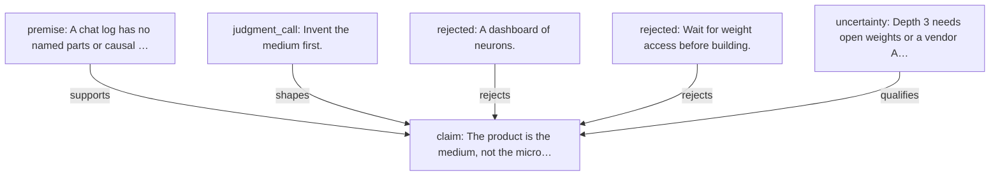

# Thought graph — Invent the medium first

## Summary

Depth-1 **story** graph (not a circuit trace). Session `01M14CANVASAAAAAAAAAAA0002`. Graph `01M14CANVASAAAAAAAAAAA0001`.

## Prose

> The product is the medium, not the microscope.

## Graph

## Claims

- `01M14CANVASAAAAAAAAAAA00A1` · accepted · model — The product is the medium, not the microscope.

## Premises

- `01M14CANVASAAAAAAAAAAA00A2` · accepted · model — A chat log has no named parts or causal tests.

## Analogies

## Judgment calls

- `01M14CANVASAAAAAAAAAAA00A3` · accepted · model — Invent the medium first.

## Uncertainties

- `01M14CANVASAAAAAAAAAAA00A6` · uncertain · model — Depth 3 needs open weights or a vendor API.

## Negative space

Rejected alternatives are first-class. They stay even when the surviving chain moves on.

- `01M14CANVASAAAAAAAAAAA00A4` · rejected · model — A dashboard of neurons.
- `01M14CANVASAAAAAAAAAAA00A5` · rejected · model — Wait for weight access before building.

## Edges

| from | kind | to |
|---|---|---|
| `01M14CANVASAAAAAAAAAAA00A2` | supports | `01M14CANVASAAAAAAAAAAA00A1` |
| `01M14CANVASAAAAAAAAAAA00A3` | shapes | `01M14CANVASAAAAAAAAAAA00A1` |
| `01M14CANVASAAAAAAAAAAA00A4` | rejects | `01M14CANVASAAAAAAAAAAA00A1` |
| `01M14CANVASAAAAAAAAAAA00A5` | rejects | `01M14CANVASAAAAAAAAAAA00A1` |
| `01M14CANVASAAAAAAAAAAA00A6` | qualifies | `01M14CANVASAAAAAAAAAAA00A1` |

## Forks and discarded branches

- parent graph: none
- fork node: none
- discarded: none

## Related

- [[wiki/Concepts/thought-archaeology|Thought archaeology]]
- [[wiki/Entities/thought-archaeology|thought-archaeology (tool)]]
- [[wiki/Sources/thought-archaeology-design|Design document]]

## Sources

- Graph JSON `graphs/01M14CANVASAAAAAAAAAAA0001.json` in the thought-archaeology store (not the wiki `raw/` tree until ingested).
